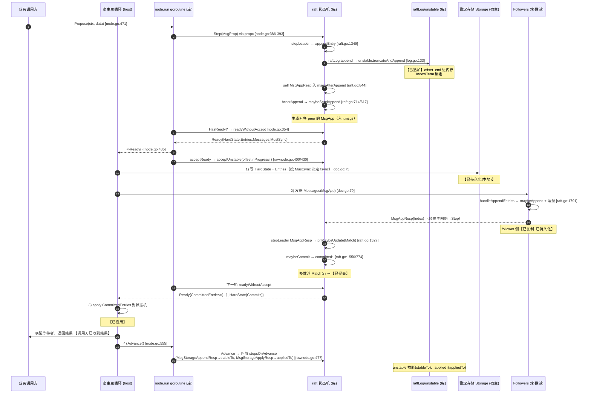

# Raft 提案生命周期：从 Propose 到「调用方已收到结果」

> 面向事故复盘与集成审查的中文说明。本文基于当前仓库（`go.etcd.io/raft/v3`）的真实实现，梳理一条普通提案（`MsgProp`）从 `Node`/`RawNode` 接口进入 raft 状态机、追加到 unstable log、复制到多数派、推进 commit，再经 `Ready` 交给宿主完成持久化、发消息、应用 `CommittedEntries`、调用 `Advance` 的完整链路。
>
> 重点回答两个线上问题：
>
> 1. **命令已在本地 WAL 里，但调用方迟迟看不到状态机结果** —— 「已持久化」不等于「已提交」，更不等于「已应用」；本文用游标衔接说明卡点可能在哪。
> 2. **崩溃重启或换 leader 后又应用了一次旧命令** —— 「已应用」的边界由宿主的 `Applied` 游标和 apply 的幂等/落盘顺序共同兑现，库本身不持久化 `applied`。

---

## 0. 关键文件与函数索引

| 关注点 | 文件 | 关键符号 |
| --- | --- | --- |
| 对外并发接口（goroutine + channel） | [node.go](file:///e:/newGsb/generated/question-exchange/questions/GSB-003/Poseidon/node.go) | `Node` 接口、`node.run`、`Propose`、`stepWithWaitOption`、`Ready`、`Advance` |
| 线程不安全内核封装 | [rawnode.go](file:///e:/newGsb/generated/question-exchange/questions/GSB-003/Poseidon/rawnode.go) | `RawNode.readyWithoutAccept`、`acceptReady`、`Advance`、`MustSync`、`newStorageAppendMsg`、`newStorageAppendRespMsg`、`newStorageApplyMsg` |
| 状态机核心 | [raft.go](file:///e:/newGsb/generated/question-exchange/questions/GSB-003/Poseidon/raft.go) | `send`、`appendEntry`、`bcastAppend`、`maybeSendAppend`、`maybeCommit`、`stepLeader`(MsgProp/MsgAppResp)、`handleAppendEntries`、`handleSnapshot`、`advance`(`appliedTo`) |
| 日志聚合层 | [log.go](file:///e:/newGsb/generated/question-exchange/questions/GSB-003/Poseidon/log.go) | `raftLog`、`maybeAppend`、`append`、`commitTo`、`maybeCommit`、`nextUnstableEnts`、`nextCommittedEnts`、`maxAppliableIndex`、`acceptApplying`、`appliedTo`、`stableTo` |
| unstable（内存中未落盘部分） | [log_unstable.go](file:///e:/newGsb/generated/question-exchange/questions/GSB-003/Poseidon/log_unstable.go) | `unstable`、`offset`、`offsetInProgress`、`nextEntries`、`acceptInProgress`、`stableTo`、`truncateAndAppend`、`restore` |
| 稳定存储抽象（宿主实现） | [storage.go](file:///e:/newGsb/generated/question-exchange/questions/GSB-003/Poseidon/storage.go) | `Storage` 接口、`MemoryStorage` |
| 复制进度 | [tracker/progress.go](file:///e:/newGsb/generated/question-exchange/questions/GSB-003/Poseidon/tracker/progress.go) | `Progress.Match`、`Progress.Next`、`MaybeUpdate`、`BecomeReplicate/Probe/Snapshot` |
| 官方使用约定 | [doc.go](file:///e:/newGsb/generated/question-exchange/questions/GSB-003/Poseidon/doc.go) | 同步/异步两种主循环范式 |

---

## 1. 六个状态词的精确定义

下面六个词在事故复盘里经常被混用，必须严格区分。括号中给出代码里的判定点。

| 状态 | 含义 | 谁负责 | 代码判定 |
| --- | --- | --- | --- |
| **已追加 (appended)** | 条目进入了本节点的内存日志（`unstable.entries`），拿到了确定的 `Index`/`Term`。**仅在内存中。** | 库 | `raft.appendEntry` → `raftLog.append` → `unstable.truncateAndAppend`（[raft.go:811](file:///e:/newGsb/generated/question-exchange/questions/GSB-003/Poseidon/raft.go#L811-L846)） |
| **已持久化 (persisted/stable)** | 该条目 + 对应 `HardState` 已被宿主写入稳定存储（WAL/Storage），重启不丢。 | **宿主**（库只发出 `Ready.Entries`/`HardState`）；完成后经 `Advance`/`MsgStorageAppendResp` 通知库 `stableTo` | 宿主写盘 → `raftLog.stableTo`/`unstable.stableTo`（[log_unstable.go:138](file:///e:/newGsb/generated/question-exchange/questions/GSB-003/Poseidon/log_unstable.go#L138-L164)） |
| **已复制 (replicated)** | 该条目出现在某个 follower 的日志里，follower 用 `MsgAppResp` 回执确认。 | 库（leader 追踪 `Progress.Match`） | `handleAppendEntries` 回 `MsgAppResp`（[raft.go:1800](file:///e:/newGsb/generated/question-exchange/questions/GSB-003/Poseidon/raft.go#L1800-L1802)）；leader 侧 `pr.MaybeUpdate`（[raft.go:1527](file:///e:/newGsb/generated/question-exchange/questions/GSB-003/Poseidon/raft.go#L1527)） |
| **已提交 (committed)** | 该 index 已在**多数派**的稳定存储上，且满足当前任期约束，`raftLog.committed` 前进到 ≥ 它。**一旦提交即不可回滚。** | 库 | `raft.maybeCommit` → `raftLog.maybeCommit` → `commitTo`（[raft.go:774](file:///e:/newGsb/generated/question-exchange/questions/GSB-003/Poseidon/raft.go#L774-L778)、[log.go:455](file:///e:/newGsb/generated/question-exchange/questions/GSB-003/Poseidon/log.go#L455-L464)） |
| **已应用 (applied)** | 宿主状态机真正执行了该条目（写入业务存储/内存表）。 | **宿主**执行；库只通过 `Ready.CommittedEntries` 投递并跟踪 `applied` 游标 | 宿主消费 `CommittedEntries` → `Advance` → `raftLog.appliedTo`（[log.go:332](file:///e:/newGsb/generated/question-exchange/questions/GSB-003/Poseidon/log.go#L332-L345)） |
| **调用方已收到结果 (client-visible)** | 发起 `Propose` 的业务调用方能读到该命令产生的状态机结果。 | **宿主**（`Propose` 只保证「提交到 raft 输入队列」，不保证提交，也不返回结果） | `node.Propose` 的返回只表示 `Step` 被执行完（[node.go:471](file:///e:/newGsb/generated/question-exchange/questions/GSB-003/Poseidon/node.go#L471-L473)、[node.go:514](file:///e:/newGsb/generated/question-exchange/questions/GSB-003/Poseidon/node.go#L514-L551)） |

**关键结论（对应线上问题 1）**：`Propose` 返回 `nil` 只代表提案进入了 leader 的 `MsgProp` 处理并被追加到本地 unstable log，**既不代表已持久化，也不代表已提交、已应用**。调用方看到结果必须由宿主自己在应用 `CommittedEntries` 时通过 `Index` 唤醒等待者（本库不提供 proposal→result 的关联，见 [node.go:139](file:///e:/newGsb/generated/question-exchange/questions/GSB-003/Poseidon/node.go#L138-L140) 的注释「proposals can be lost without notice」）。

---

## 2. 保证归属：库 vs 宿主

| 保证 | 由谁兑现 | 说明 |
| --- | --- | --- |
| 分配单调递增的 `Index`/`Term` | **库** | `appendEntry` 里 `cloned[i].Index = li+1+i`、`Term = r.Term`（[raft.go:816](file:///e:/newGsb/generated/question-exchange/questions/GSB-003/Poseidon/raft.go#L816-L818)） |
| 只在多数派持有后推进 commit | **库** | `maybeCommit` 用 `r.trk.Committed()`（quorum 的 Match）判定 |
| 提交的条目顺序、不回滚、不重排 | **库** | `commitTo` 只增不减（[log.go:322](file:///e:/newGsb/generated/question-exchange/questions/GSB-003/Poseidon/log.go#L322-L330)） |
| 冲突日志的检测与回退追赶 | **库** | `findConflict`/`findConflictByTerm`/`MaybeDecrTo` |
| 计算 `Ready`（要写什么、要发什么、要应用什么） | **库** | `readyWithoutAccept` |
| **把 `Entries`+`HardState`+`Snapshot` 真正写入稳定存储** | **宿主** | 库只产出 `Ready`，宿主必须落盘；见 [doc.go:75](file:///e:/newGsb/generated/question-exchange/questions/GSB-003/Poseidon/doc.go#L75-L77) |
| **在 `HardState`/`Entries` 落盘后再发 `Messages`** | **宿主** | 同步模式下 `Ready.Messages` 契约要求先落盘后发送；见 [node.go:99](file:///e:/newGsb/generated/question-exchange/questions/GSB-003/Poseidon/node.go#L98-L106) |
| **把 `CommittedEntries` 应用到状态机（幂等、按序）** | **宿主** | 库不知道业务语义 |
| **持久化「已应用到哪个 index」** | **宿主** | 库不持久化 `applied`；重启时靠 `Config.Applied` 回填（[raft.go:147](file:///e:/newGsb/generated/question-exchange/questions/GSB-003/Poseidon/raft.go#L147-L151)、[raft.go:484](file:///e:/newGsb/generated/question-exchange/questions/GSB-003/Poseidon/raft.go#L484-L485)） |
| **把命令结果回送业务调用方** | **宿主** | 库无此机制 |
| 把已落盘/已应用的事实回告库（推进 unstable/applied 游标） | **宿主触发、库执行** | 同步：`Advance`；异步：`MsgStorageAppendResp`/`MsgStorageApplyResp` |

**关键结论（对应线上问题 2）**：「不重复应用旧命令」**不是库单方面的保证**。库保证 `committed`/`applied` 游标在**单个进程生命周期内**单调，但 `applied` 不落盘。崩溃重启后，若宿主没有把「上次应用到哪」通过 `Config.Applied` 正确回填，或状态机的应用不是幂等/不是原子落盘，就会重放已应用过的条目——这正是「换 leader / 崩溃重启后又应用一次旧命令」的根因。

---

## 3. 跨库与宿主边界的时序图（同步 Ready/Advance 模式，正常提交）



> 说明：同步模式下 `Advance` 内部并不是「重新解析 Ready」，而是回放在 `acceptReady` 阶段就已算好的 `stepsOnAdvance`（自指的 `MsgStorageAppendResp`、`MsgStorageApplyResp` 以及 leader 自投的 `MsgAppResp`），见 [rawnode.go:477-489](file:///e:/newGsb/generated/question-exchange/questions/GSB-003/Poseidon/rawnode.go#L477-L489) 与 [rawnode.go:410-435](file:///e:/newGsb/generated/question-exchange/questions/GSB-003/Poseidon/rawnode.go#L410-L435)。这些自指消息把「已持久化」「已应用」的事实回告库，从而推进 `stableTo`/`appliedTo`。

---

## 4. `Ready` 各字段与游标的衔接

### 4.1 `Ready` 字段（[node.go:52-115](file:///e:/newGsb/generated/question-exchange/questions/GSB-003/Poseidon/node.go#L52-L115)）

| 字段 | 含义 | 宿主动作 | 组装点 |
| --- | --- | --- | --- |
| `HardState` | 需持久化的 `{Term, Vote, Commit}`；只在变化时非空 | 先于 `Messages` 落盘 | `readyWithoutAccept`：`hardState() != prevHardSt` 时置入 |
| `Entries` | 待写入稳定存储、且尚未 in-progress 的 unstable 条目 | 落盘（写 Index i 时须丢弃 ≥ i 的旧条目） | `raftLog.nextUnstableEnts` = `unstable.nextEntries`（[log_unstable.go:100](file:///e:/newGsb/generated/question-exchange/questions/GSB-003/Poseidon/log_unstable.go#L100-L106)） |
| `Snapshot` | 待持久化并应用的快照 | 落盘 + 应用到状态机 | `raftLog.nextUnstableSnapshot`（存在且未 in-progress） |
| `CommittedEntries` | 已提交、可应用的条目 | 按序应用到状态机 | `raftLog.nextCommittedEnts`（[log.go:220](file:///e:/newGsb/generated/question-exchange/questions/GSB-003/Poseidon/log.go#L220-L244)） |
| `Messages` | 出站消息 | 发送（同步模式：须在 `HardState`/`Entries` 落盘后） | `r.msgs` + 同步模式追加 `msgsAfterAppend` 中发往他人的（[rawnode.go:174-184](file:///e:/newGsb/generated/question-exchange/questions/GSB-003/Poseidon/rawnode.go#L174-L184)） |
| `MustSync` | `HardState`+`Entries` 是否必须**持久化(fsync)** 而非可缓写 | 决定是否 `fsync` | `MustSync(st, prevst, len(Entries))`（[rawnode.go:191-198](file:///e:/newGsb/generated/question-exchange/questions/GSB-003/Poseidon/rawnode.go#L191-L198)） |
| `SoftState` / `ReadStates` | 易失的 leader/角色信息 / 线性一致读游标 | 无需持久化 | 变化时置入 |

**`MustSync` 的判定**：`entsnum != 0 || Vote 变 || Term 变`。即只要有新日志、或投票/任期变化，就必须真正落盘（对应 Raft 论文 3.8「currentTerm、votedFor、log entries 必须在响应 RPC 前持久化」）。仅 `Commit` 前进（无新条目、term/vote 未变）时 `MustSync=false`，可容忍非持久写——因为 `Commit` 可在重启后由日志重新推导。

### 4.2 unstable 的 `offset` / `offsetInProgress` / stable（[log_unstable.go:37-51](file:///e:/newGsb/generated/question-exchange/questions/GSB-003/Poseidon/log_unstable.go#L37-L54)）

`unstable` 持有「尚未确认落盘」的日志尾巴与可选快照，用两个游标切成三段：

```
storage(已落盘)         | entries 在内存中
... i < offset ........ | [offset, offsetInProgress) 正在写盘 | [offsetInProgress, end) 待写盘
                         └─ 已交给某个 Ready，等回执     └─ 下个 Ready 的 Entries
```

- `offset`：`entries[0]` 的 raft index；`entries[i]` 位于 `i+offset`。
- `offsetInProgress`（独占上界）：`entries[:offsetInProgress-offset]` 已通过某个 `Ready` 交给宿主、正在写盘。
- `nextEntries()` 只返回 `entries[offsetInProgress-offset:]`，避免把「正在写」的条目重复放进下一个 `Ready`（[log_unstable.go:100](file:///e:/newGsb/generated/question-exchange/questions/GSB-003/Poseidon/log_unstable.go#L100-L106)）。
- `acceptInProgress()`（在 `acceptReady` 中调用）把 `offsetInProgress` 推到末尾+1，标记「本批已下发」（[log_unstable.go:122](file:///e:/newGsb/generated/question-exchange/questions/GSB-003/Poseidon/log_unstable.go#L122-L130)）。
- `stableTo(id)`（宿主回执后）把 `entries` 从头截断到 `id.index+1`、推进 `offset`，真正释放内存（[log_unstable.go:138](file:///e:/newGsb/generated/question-exchange/questions/GSB-003/Poseidon/log_unstable.go#L138-L164)）。**注意其中的 term 校验**：若 `id.term` 与当前 unstable 中该 index 的 term 不符则忽略——这防止「回执迟到、日志已被新 leader 覆盖」时错误截断（ABA 问题，详见 [rawnode.go:274-358](file:///e:/newGsb/generated/question-exchange/questions/GSB-003/Poseidon/rawnode.go#L274-L358) 的长注释）。

### 4.3 committed / applying / applied 游标（[log.go:33-63](file:///e:/newGsb/generated/question-exchange/questions/GSB-003/Poseidon/log.go#L33-L64)）

三个游标满足不变式 **`applied <= applying <= committed`**：

- `committed`：多数派已持有的最高 index，由 `commitTo`/`maybeCommit` 推进，**只增不减**。
- `applying`：已经通过 `CommittedEntries` **下发**给宿主（可能还在应用中）的最高 index。在 `acceptReady` 里由 `acceptApplying` 推进（[log.go:347](file:///e:/newGsb/generated/question-exchange/questions/GSB-003/Poseidon/log.go#L347-L365)）。
- `applied`：宿主**确认应用完成**的最高 index，由 `appliedTo` 推进（[log.go:332](file:///e:/newGsb/generated/question-exchange/questions/GSB-003/Poseidon/log.go#L332-L345)）。同步模式在 `Advance` 回放 `MsgStorageApplyResp` 时触发。

`nextCommittedEnts` 只取 `(applying, maxAppliableIndex]`，因此**同一条目不会被投递两次**（在同一进程内）；`maxAppliableIndex` 在同步模式允许取到 `committed`，异步模式则被 `min(committed, unstable.offset-1)` 限制（见 §6）。

### 4.4 Progress.Match / Next 与 commit 的衔接（[tracker/progress.go:33-41](file:///e:/newGsb/generated/question-exchange/questions/GSB-003/Poseidon/tracker/progress.go#L33-L41)）

- `Match`：leader 已知某 follower 复制到的最高 index；`Next`：下一条要发给它的 index。
- follower 的 `MsgAppResp(Index)` 到达 leader → `pr.MaybeUpdate(Index)` 抬高 `Match`（[raft.go:1527](file:///e:/newGsb/generated/question-exchange/questions/GSB-003/Poseidon/raft.go#L1527)、[progress.go:205](file:///e:/newGsb/generated/question-exchange/questions/GSB-003/Poseidon/tracker/progress.go#L202-L216)）。
- `maybeCommit` 取所有 voter 的 `Match` 的 quorum 值（`r.trk.Committed()`）作为候选 commit index，再要求该 index 的条目属于当前任期（`entryID{term: r.Term, ...}` + `matchTerm`），才 `commitTo`（[raft.go:774](file:///e:/newGsb/generated/question-exchange/questions/GSB-003/Poseidon/raft.go#L774-L778)、[log.go:455](file:///e:/newGsb/generated/question-exchange/questions/GSB-003/Poseidon/log.go#L455-L464)）。
- **leader 自身**没有 `MsgApp`，而是在 `appendEntry` 里向自己发一条 `MsgAppResp`，塞进 `msgsAfterAppend`，在本地日志落盘后（`Advance`/append 回执）才回放，从而更新自己的 `Match` 并触发 commit（[raft.go:834-844](file:///e:/newGsb/generated/question-exchange/questions/GSB-003/Poseidon/raft.go#L834-L846)）。这解释了「leader 也必须先把日志落盘，才把自己算进多数派」。

---

## 5. 七种场景对比

下面每种场景标出：命中的代码路径、`Ready` 内容、游标变化、以及**对两个线上问题的含义**。

### 场景 A：正常提交（基线）

见 §3 时序图。链路：`Propose → appendEntry(已追加) → Ready.Entries + Messages → 宿主落盘(已持久化) + 发 MsgApp → follower 回执 → Match↑ → maybeCommit(已提交) → 下一 Ready.CommittedEntries → 宿主 apply(已应用) → Advance(stableTo/appliedTo)`。

- 一条提案通常跨**两个** `Ready`：第一个带 `Entries`/`Messages`，第二个带 `CommittedEntries`（也可能因批处理合并在相邻轮次）。
- 参考测试：`TestRawNodeConsumeReady`（[rawnode_test.go:937](file:///e:/newGsb/generated/question-exchange/questions/GSB-003/Poseidon/rawnode_test.go#L937)）验证 `acceptReady` 后再次 `Ready()` 不重复给出同一批消息；`TestNodeAdvance`（[node_test.go:654](file:///e:/newGsb/generated/question-exchange/questions/GSB-003/Poseidon/node_test.go#L654)）验证不调用 `Advance` 就不产生下一个包含 `CommittedEntries` 的 `Ready`。

### 场景 B：follower 日志冲突后回退追赶

- follower 收到 `MsgApp`，`handleAppendEntries` 先检查 `prev`：若 `a.prev.index < committed` 直接回 `committed`（[raft.go:1796](file:///e:/newGsb/generated/question-exchange/questions/GSB-003/Poseidon/raft.go#L1796-L1799)）；否则 `maybeAppend`。
- `maybeAppend` 用 `matchTerm(prev)` 校验衔接点，用 `findConflict` 找到第一处 index 相同但 term 不同的条目，**从冲突点起覆盖**（`unstable.truncateAndAppend` 走 `truncate` 分支，[log_unstable.go:200](file:///e:/newGsb/generated/question-exchange/questions/GSB-003/Poseidon/log_unstable.go#L200-L222)）。**已提交的条目永不会被覆盖**——`maybeAppend` 里 `ci <= l.committed` 直接 panic（[log.go:120-121](file:///e:/newGsb/generated/question-exchange/questions/GSB-003/Poseidon/log.go#L120-L121)）。
- 若不匹配，follower 回 `Reject` + `RejectHint`/`LogTerm`（[raft.go:1823-1832](file:///e:/newGsb/generated/question-exchange/questions/GSB-003/Poseidon/raft.go#L1823-L1832)）。leader 侧 `MaybeDecrTo` 下调 `Next`，并用 `findConflictByTerm` 跳过整段 term 以加速回退（[raft.go:1509-1516](file:///e:/newGsb/generated/question-exchange/questions/GSB-003/Poseidon/raft.go#L1509-L1516)），随后 `sendAppend` 重试直至命中共同前缀，`Progress` 从 `StateProbe` 回到 `StateReplicate`。
- **含义**：日志冲突由库自动收敛，宿主无需干预；但宿主写盘时必须遵守 [doc.go:76-77](file:///e:/newGsb/generated/question-exchange/questions/GSB-003/Poseidon/doc.go#L75-L77)「写 Index i 时丢弃所有 ≥ i 的旧条目」，否则稳定存储会残留被覆盖的脏尾巴。

### 场景 C：落后节点通过 snapshot 恢复

- leader 侧：`maybeSendAppend` 取不到 `pr.Next-1` 的 term（日志已被压缩）→ `maybeSendSnapshot` 发 `MsgSnap`，`Progress` 进入 `StateSnapshot`（[raft.go:623-628](file:///e:/newGsb/generated/question-exchange/questions/GSB-003/Poseidon/raft.go#L617-L661)）。
- follower 侧：`handleSnapshot → restore`（[raft.go:1840](file:///e:/newGsb/generated/question-exchange/questions/GSB-003/Poseidon/raft.go#L1840-L1855)）；`raftLog.restore` 把 `committed` 抬到快照 index，`unstable.restore` 设 `offset = snap.Index+1`、清空 entries、挂上待应用快照（[log.go:466](file:///e:/newGsb/generated/question-exchange/questions/GSB-003/Poseidon/log.go#L466-L470)、[log_unstable.go:192](file:///e:/newGsb/generated/question-exchange/questions/GSB-003/Poseidon/log_unstable.go#L192-L198)）。
- 此后 `Ready.Snapshot` 非空。**宿主必须先持久化快照再应用到状态机**，并且 `nextCommittedEnts` 在有待应用快照时返回 `nil`（`hasNextOrInProgressSnapshot`，[log.go:225-228](file:///e:/newGsb/generated/question-exchange/questions/GSB-003/Poseidon/log.go#L225-L228)）——避免快照与普通条目谁先应用的歧义。
- follower `restore` 成功后回 `MsgAppResp(lastIndex)`；leader 收到后若 `Match+1 >= firstIndex` 则从 `StateSnapshot` 经 probe 回到 `StateReplicate`（[raft.go:1531-1545](file:///e:/newGsb/generated/question-exchange/questions/GSB-003/Poseidon/raft.go#L1531-L1545)）。
- 参考测试：`TestRawNodeRestartFromSnapshot`（[rawnode_test.go:685](file:///e:/newGsb/generated/question-exchange/questions/GSB-003/Poseidon/rawnode_test.go#L685)）、`TestNodeRestartFromSnapshot`（[node_test.go:605](file:///e:/newGsb/generated/question-exchange/questions/GSB-003/Poseidon/node_test.go#L605)）。
- **含义（关系到问题 2）**：快照恢复时 `applied` 被重置到快照 index。宿主重启若用快照恢复状态机，必须保证 `Config.Applied` 与快照一致，否则会重放快照之后、已应用过的条目。

### 场景 D：leader 本地持久化后、但多数派提交前失去领导权

- 时序：leader 追加条目 i（已追加）→ `Ready.Entries` 落盘（本地已持久化）→ 尚未收到多数派 `MsgAppResp`，`committed` 未到 i → 此时更高任期的 `MsgVote`/`MsgApp` 到达，本节点 `becomeFollower`。
- 结果：条目 i 在本地 WAL 里，但**从未 committed**。新 leader 若其日志不含 i，会用 `MsgApp` 触发场景 B 的冲突覆盖，把 i 从本节点日志中截掉；`Propose` 的调用方永远等不到结果（提案静默丢失，符合 [node.go:138-140](file:///e:/newGsb/generated/question-exchange/questions/GSB-003/Poseidon/node.go#L138-L140) 的约定）。
- **含义（正是线上问题 1 的一种）**：「命令已在本地 WAL，但调用方看不到结果」——因为它只到了「已持久化」，没到「已提交」。**已持久化 ≠ 已提交**。宿主不能凭「写盘成功」就回执客户端成功；必须等它出现在 `CommittedEntries` 里。若失去领导权，宿主应对所有 pending proposal 超时/重试，而非无限等待。

### 场景 E：多数派已提交、但状态机尚未应用

- 时序：`maybeCommit` 已把 `committed` 抬到 i（已提交，不可回滚），但宿主还没消费本轮 `Ready.CommittedEntries`，或 `applyingEntsPaused`（应用积压达到 `maxApplyingEntsSize`，`nextCommittedEnts` 返回 `nil`，[log.go:221-223](file:///e:/newGsb/generated/question-exchange/questions/GSB-003/Poseidon/log.go#L221-L223)）。
- 此时 `applied < committed`。调用方仍看不到结果——卡点在宿主的 apply 环节，而非 raft。
- **含义（线上问题 1 的另一种）**：「已提交 ≠ 已应用 ≠ 调用方可见」。排查时应看 `Status()` 里 `Commit` 与 `Applied` 的差值：若 `Commit` 一直领先 `Applied`，说明宿主 apply 线程慢/卡/被 `maxApplyingEntsSize` 限流，或 `Advance` 没被调用（下一批 `CommittedEntries` 因此不再产出，见 `TestNodeAdvance`）。

### 场景 F：应用完成后、但 `Advance` 前进程崩溃

- 时序：宿主已把 `CommittedEntries` 应用到状态机（业务数据已落盘），但还没调用 `Advance`（因此 `raftLog.applied` 未推进，且这次的 `applied` 本来也不落盘）→ 进程崩溃。
- 重启：从 `Storage` 重建 `raftLog`，`committed/applying/applied` 初始化为 `firstIndex-1`，再由 `Config.Applied` 回填（[log.go:94-96](file:///e:/newGsb/generated/question-exchange/questions/GSB-003/Poseidon/log.go#L94-L96)、[raft.go:484-485](file:///e:/newGsb/generated/question-exchange/questions/GSB-003/Poseidon/raft.go#L484-L485)）。若宿主 `Config.Applied` 落后于实际已应用的 index，则这些条目会**再次**出现在 `CommittedEntries` 中，被**重放**。
- **含义（正是线上问题 2 的根因）**：`Advance` 未及时调用本身不会「丢」数据，但**库不持久化 `applied`**，所以「不重复应用」完全依赖：(1) 宿主把状态机应用做成**幂等**或与「记录 applied index」**同一原子事务**落盘；(2) 重启时用真实的持久化 applied 值回填 `Config.Applied`。二者缺一，就会「崩溃重启后又应用一次旧命令」。这不是库的 bug，是集成契约。

### 场景 G：启用 `AsyncStorageWrites` 后的处理顺序

启用后（`Config.AsyncStorageWrites=true`），宿主**不再**直接消费 `HardState`/`Entries`/`Snapshot`/`CommittedEntries`，也**不再调用 `Advance`**（调用会 panic，[rawnode.go:481-483](file:///e:/newGsb/generated/question-exchange/questions/GSB-003/Poseidon/rawnode.go#L481-L483)）。所有本地存储操作改为 `Ready.Messages` 中的两类自指消息：

| 消息 | 目标 | 载荷 | 处理后须回送 | 组装点 |
| --- | --- | --- | --- | --- |
| `MsgStorageAppend` | `LocalAppendThread` | `Entries` + `HardState`(Term/Vote/Commit) + `Snapshot` | 处理完发 `Responses`（含发往其他节点的 `MsgAppResp` 及自指 `MsgStorageAppendResp`） | `newStorageAppendMsg`（[rawnode.go:223](file:///e:/newGsb/generated/question-exchange/questions/GSB-003/Poseidon/rawnode.go#L223-L260)） |
| `MsgStorageApply` | `LocalApplyThread` | `CommittedEntries` | 处理完发 `MsgStorageApplyResp` | `newStorageApplyMsg`（[rawnode.go:372](file:///e:/newGsb/generated/question-exchange/questions/GSB-003/Poseidon/rawnode.go#L372-L382)） |

顺序规则（[doc.go:189-198](file:///e:/newGsb/generated/question-exchange/questions/GSB-003/Poseidon/doc.go#L189-L198)、[rawnode.go:163-173](file:///e:/newGsb/generated/question-exchange/questions/GSB-003/Poseidon/rawnode.go#L163-L173)）：

1. **同一 target 的消息必须按顺序、可靠处理**（不能丢、不能重排）；不同 target 之间可并行。
2. `MsgStorageAppend` 携带的 `Responses` 只有在**写入持久化完成后**才允许发出——这把「发 `MsgAppResp` 给 leader / 发 `MsgVoteResp`」的时机与本地落盘绑定，等价于同步模式「先落盘后发消息」的约束，只是下沉到了 append 线程。
3. `MsgStorageApplyResp` 在**应用完成后**发出，回到 raft 后推进 `applied`（`appliedTo`）。
4. 关键差异：`applyUnstableEntries()` 返回 `!asyncStorageWrites`（[rawnode.go:443-445](file:///e:/newGsb/generated/question-exchange/questions/GSB-003/Poseidon/rawnode.go#L443-L445)）。因此异步模式下 `maxAppliableIndex` 被 `min(committed, unstable.offset-1)` 收紧（[log.go:267-273](file:///e:/newGsb/generated/question-exchange/questions/GSB-003/Poseidon/log.go#L267-L273)）——**只应用已确认落盘的条目**；同步模式则允许应用尚在 unstable 里的已提交条目（因为宿主承诺在同一轮里先写盘）。
5. `acceptReady` 里，异步模式不生成 `stepsOnAdvance`（那套自指回执改由存储线程的 `Resp` 消息承担），并直接清空待发 Ready（[node.go:437-441](file:///e:/newGsb/generated/question-exchange/questions/GSB-003/Poseidon/node.go#L437-L441)）。
- 参考测试：`TestCommitPaginationWithAsyncStorageWrites`（[node_test.go:855](file:///e:/newGsb/generated/question-exchange/questions/GSB-003/Poseidon/node_test.go#L855)）。
- **含义**：异步模式把「先持久化后发投票/append 回执」「先落盘后应用」的顺序保证，从宿主主循环的手写顺序，转成了「storage 线程处理完消息再发 Responses」的顺序。宿主实现存储线程时若**打乱同一 target 的顺序或丢消息**，会直接破坏 Raft 安全性（例如在 append 落盘前就把 `MsgVoteResp`/`MsgAppResp` 发出去，等于「未持久化就投票/确认」）。

---

## 6. 同步 vs 异步 关键差异速查

| 维度 | 同步（Ready/Advance） | 异步（AsyncStorageWrites） |
| --- | --- | --- |
| 落盘/应用触发 | 宿主直接读 `Ready` 字段 | 消费 `Messages` 里的 `MsgStorageAppend`/`MsgStorageApply` |
| 回告库 | `Advance()`（回放 `stepsOnAdvance`） | 存储线程发 `...Resp` 自指消息 |
| 是否应用 unstable 中已提交条目 | 是（`applyUnstableEntries=true`） | 否，先落盘（`min(committed, offset-1)`） |
| 发消息与落盘顺序 | 宿主手动保证「先落盘后发」 | append 线程处理完再发 `Responses` |
| `Advance` | 必须调用 | **禁止调用（panic）** |

---

## 7. 事故复盘检查清单

针对两个线上问题的定位顺序：

**问题 1「WAL 里有，但调用方看不到结果」**

1. 看 `Status()`：`Commit` 是否 ≥ 该条目 index？
   - 否 → 停在「已持久化未提交」。可能是失去领导权（场景 D）或多数派未达成（网络/follower 落后）。检查各 `Progress.Match`。
2. `Commit` ≥ index 但 `Applied` < index → 停在「已提交未应用」（场景 E）。检查宿主 apply 线程是否卡住、是否触发 `maxApplyingEntsSize` 限流、`Advance` 是否被调用。
3. `Applied` ≥ index 但调用方仍无结果 → 宿主没把 apply 结果关联回 proposal 等待者（库不提供该机制，需宿主自建 index→waiter 表）。

**问题 2「重启/换 leader 后重复应用旧命令」**

1. 确认宿主是否持久化了「已应用到哪个 index」，且重启时正确回填 `Config.Applied`（[raft.go:147-151](file:///e:/newGsb/generated/question-exchange/questions/GSB-003/Poseidon/raft.go#L147-L151)）。**库不持久化 `applied`**。
2. 确认状态机应用与「记录 applied index」是否原子（同一事务），或应用是否幂等（场景 F）。
3. 快照恢复路径确认 `Config.Applied` 与快照 index 一致（场景 C）。
4. 异步模式下确认存储线程未丢弃/重排同 target 消息（场景 G）。

---

## 8. 一句话总结

- **库负责**：定序、复制、判定 commit、算出每轮该写/该发/该应用什么、并在收到「已落盘/已应用」回执后推进内部游标。这些保证只在**单进程生命周期内**成立且不回滚。
- **宿主负责**：真正把日志与 `HardState`/快照落盘、按序发消息、幂等且原子地应用 `CommittedEntries`、持久化 applied 进度并在重启时回填、把结果回送调用方。
- 两个线上问题的本质都在边界上：问题 1 是把「已追加/已持久化」误当成「已提交/已应用/可见」；问题 2 是把「不重复应用」误当成库的保证，而它其实要靠宿主的幂等应用 + 持久化 applied + 正确的 `Config.Applied` 回填来兑现。
