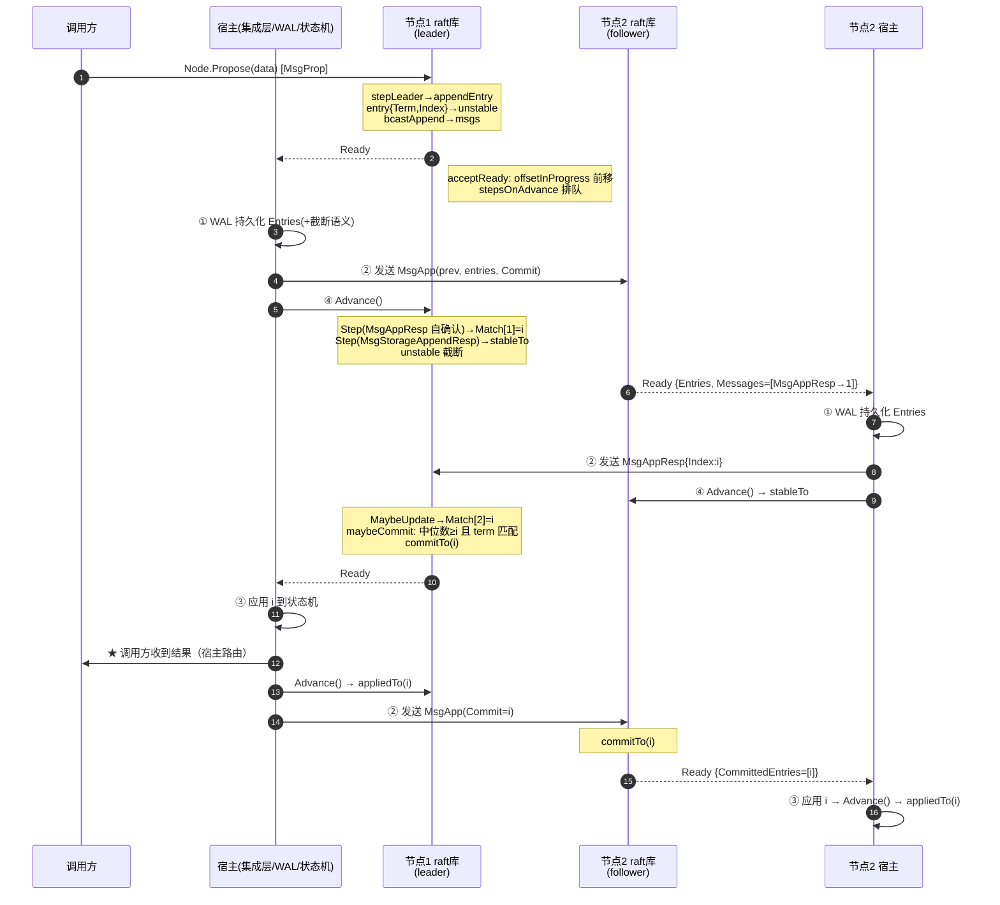
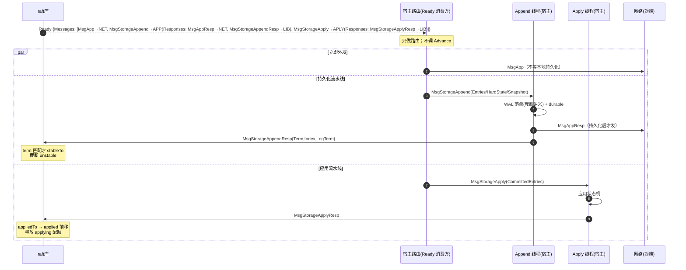

# Raft Ready/Advance 生命周期与宿主契约

> 用途：事故复盘与集成审查。本文基于本仓库（go.etcd.io/raft/v3）当前实现，梳理一条普通提案从 `Node`/`RawNode` 接口进入 raft 状态机、追加到 unstable log、复制到多数派、推进 commit，再经 `Ready` 交给宿主完成持久化、发消息、应用 `CommittedEntries` 并调用 `Advance` 的完整链路，明确**库保证什么**、**宿主必须兑现什么**。
>
> 行号引用格式为 `文件:行号`，均为本仓库根目录下的相对路径。

---

## 0. 两类典型事故的根因速查

| 现象 | 最可能的根因 | 详见 |
|---|---|---|
| 命令已在本地 WAL 中，调用方迟迟看不到状态机结果 | 已持久化 ≠ 已提交：条目尚未在多数派持久化，leader 的 `committed` 未推进；或已提交但宿主没处理 `Ready.CommittedEntries`（漏处理、未调用 `Advance` 导致下一个 Ready 卡住、apply 线程阻塞、被 applying 配额或 pending snapshot 暂停）；或宿主把 `Propose` 返回 nil 误当成"已提交" | §3、§6.1、§6.5 |
| 崩溃重启或更换 leader 后又应用了一次旧命令 | 宿主未将 applied 游标与状态机原子落盘、重启时未用 `Config.Applied` 告知 raft，导致 raft 从 `HardState.Commit` 重放 `CommittedEntries`；或宿主曾把未提交的（仅已持久化/已复制）条目提前应用，换 leader 后该条目本应被覆盖却已进入状态机 | §6.4、§6.6 |

`Node.Propose` 的文档注释明确写道：*"proposals can be lost without notice, therefore it is user's job to ensure proposal retries"*（node.go:139-140）。`Propose` 返回 nil 只代表 `MsgProp` 被 raft 状态机接受（node.go:508-551 的 `stepWithWaitOption` 等到 `Step` 返回），**不代表复制、提交或应用**。库内没有任何 proposal→结果 的映射，"调用方收到结果"完全由宿主在应用 `CommittedEntries` 后自行关联（按 index/term 或请求 ID 路由）。

---

## 1. 代码地图：关键文件与函数

| 层 | 文件 | 关键内容 |
|---|---|---|
| 线程安全门面 | node.go | `Ready` 结构（node.go:52）、`Node` 接口（node.go:132）、`node.run` 事件循环（node.go:343）、`Propose`（node.go:471）、`Advance`（node.go:555） |
| 单线程核心 | rawnode.go | `RawNode.Ready`/`readyWithoutAccept`（rawnode.go:131/139）、`acceptReady`（rawnode.go:400）、`Advance`（rawnode.go:477）、`HasReady`（rawnode.go:448）、`MustSync`（rawnode.go:191）、Async 模式的 `newStorageAppendMsg`/`newStorageAppendRespMsg`/`newStorageApplyMsg`（rawnode.go:223/266/372） |
| 协议状态机 | raft.go | `raft.Step`（raft.go:1089）、`stepLeader`/`stepCandidate`/`stepFollower`（raft.go:1275/1673/1718）、`appendEntry`（raft.go:811）、`bcastAppend`/`maybeSendAppend`/`maybeSendSnapshot`（raft.go:713/617/665）、`maybeCommit`（raft.go:774）、`handleAppendEntries`/`handleHeartbeat`/`handleSnapshot`/`restore`（raft.go:1791/1835/1840/1860）、`send` 与 `msgsAfterAppend`（raft.go:513、369-379） |
| 日志 | log.go、log_unstable.go | `raftLog`（log.go:25）与 `committed/applying/applied` 游标、`maybeAppend`（log.go:109）、`findConflict`/`findConflictByTerm`（log.go:154/182）、`nextCommittedEnts`（log.go:220）、`commitTo`/`appliedTo`/`acceptApplying`（log.go:322/332/347）；`unstable`（log_unstable.go:37）与 `offset/offsetInProgress`、`acceptInProgress`/`stableTo`/`truncateAndAppend`/`restore`（log_unstable.go:122/138/200/192） |
| 存储契约 | storage.go | `Storage` 接口（storage.go:48）、参考实现 `MemoryStorage`（`Append` 的截断语义 storage.go:293-326、`Compact` storage.go:268） |
| 复制进度 | tracker/progress.go、tracker/tracker.go、quorum/majority.go | `Progress{Match, Next, State, Inflights, PendingSnapshot}`（tracker/progress.go:30）、`ProgressTracker.Committed`（tracker/tracker.go:179）、`MajorityConfig.CommittedIndex`（quorum/majority.go:120） |
| 参考宿主 | rafttest/ | `ProcessReady`（rafttest/interaction_env_handler_process_ready.go:45）、`processAppend`（rafttest/interaction_env_handler_process_append_thread.go:84）、`processApply`（rafttest/interaction_env_handler_process_apply_thread.go:72）；包级用法文档 doc.go；最小宿主模型 `nextEnts`（raft_test.go:78-91） |

---

## 2. 六个里程碑的精确定义与保证划分

对一条日志条目（index `i`）而言：

| 里程碑 | 精确定义（代码位置） | 保证来源 |
|---|---|---|
| **已追加（appended）** | 条目进入本节点 `raftLog.unstable`：leader 侧 `appendEntry`（raft.go:811）→ `raftLog.append` → `unstable.truncateAndAppend`（log_unstable.go:200）；follower 侧 `handleAppendEntries` → `raftLog.maybeAppend`（log.go:109）。此时条目**只在内存**，尚未持久化，随时可能被新 leader 的冲突追加覆盖（`truncateAndAppend` 的 replace 分支）。 | 库 |
| **已持久化（persisted）** | 条目经 `Ready.Entries` 交给宿主并写入 `Storage`，随后经 `Advance`（或 Async 模式的 `MsgStorageAppendResp`）回报，库调用 `raftLog.stableTo` → `unstable.stableTo`（log_unstable.go:138）将其从 unstable 截断。**已持久化 ≠ 已提交**：单节点 WAL 里有该条目，不代表多数派有，不代表它最终会进入状态机；它仍可能在 leader 变更后被覆盖（宿主的 `Storage.Append` 必须实现"写入 index i 时丢弃已持久化的 index ≥ i 的旧条目"，doc.go:75-77，`MemoryStorage.Append` storage.go:313-324）。 | **宿主**（库只负责发信号与校验） |
| **已复制（replicated）** | leader 把条目装入 `MsgApp`（`maybeSendAppend` raft.go:617）发出；follower 收 `MsgAppResp`（非拒绝）后 leader 侧 `Progress.MaybeUpdate` 推进该 peer 的 `Match`（tracker/progress.go:205）。`Match = i` 表示该 follower **已持久化**到 i（因为 follower 的 `MsgAppResp` 经 `msgsAfterAppend` 机制保证在本地持久化之后才发出，raft.go:545-591）。 | 库（Match 维护）+ 宿主（消息送达、先持久化后发响应的顺序） |
| **已提交（committed）** | leader 上 `maybeCommit`（raft.go:774）→ `raftLog.maybeCommit`（log.go:455）：`trk.Committed()` 取全部 voter `Match` 的中位数（`ProgressTracker.Committed` tracker/tracker.go:179 → `MajorityConfig.CommittedIndex` quorum/majority.go:120，即多数派已确认的最大 index），**且该 index 处条目的 term 等于 leader 当前 term**（`matchTerm` 检查）才 `commitTo`。follower 经 `MsgApp.Commit`/`MsgHeartbeat.Commit` 学习后 `commitTo`（log.go:129、1836）。`committed` 单调不减（log.go:322-329）。这是安全分水岭：**已提交条目永远不会丢失、不会被覆盖**，`maybeAppend` 对 committed 段内的冲突直接 panic（log.go:120-121）。 | 库 |
| **已应用（applied）** | 条目经 `Ready.CommittedEntries` 交给宿主，宿主写入状态机并 `Advance`（或 Async 模式回 `MsgStorageApplyResp`），库推进 `applied` 游标（`raftLog.appliedTo` log.go:332）。不变式：`applied ≤ applying ≤ committed`（log.go:33-49 注释）。`applied` **不被库持久化**——这是宿主的责任。 | **宿主** |
| **调用方已收到结果** | 库不提供。宿主在应用某条 `CommittedEntry` 后，按自身关联机制（请求 ID / (index, term) 注册表）向等待中的客户端返回。**只有到达这一步**才能向调用方承诺"命令生效"。 | **宿主** |

**库自身的保证**（不需要宿主配合即成立，但以宿主履行持久化契约为前提）：

1. 选举安全与日志匹配：一票一 term（依赖 HardState 持久化）、只投给日志 up-to-date 的候选人（raft.go:1212-1262）；`MsgApp` 的 `(prevIndex, prevTerm)` 一致性检查（`maybeAppend` log.go:109-131）。
2. committed 单调、committed 条目不可覆盖（log.go:322-329、120-121）；旧 term 条目不直接计数提交，只随当前 term 条目顺带提交（`maybeCommit` 的 term 检查 log.go:455-464，对应论文 §5.4.2；测试 `TestLeaderCommitPrecedingEntries` raft_paper_test.go:466、`TestCommitWithoutNewTermEntry` raft_test.go:756）。
3. Ready 流控：同步模式下不 `Advance` 就不会产出下一个 Ready（node.go:435-446）；连续 accept 两个 Ready 而未 Advance 会 panic（rawnode.go:410-413）。
4. 顺序信号：`MsgAppResp`/`MsgVoteResp`/`MsgPreVoteResp` 一律进 `msgsAfterAppend`（raft.go:545-591），保证"先持久化、后发送"的协议级顺序不依赖宿主自觉。
5. `CommittedEntries` 恰好覆盖 `(applying, committed]` 区间、不重复、按序（`nextCommittedEnts` log.go:220-244，`acceptApplying` log.go:347）。

**必须由宿主兑现**（库无法代为保证）：

1. 按契约持久化 `HardState`/`Entries`/`Snapshot`（含截断语义），同步模式下**先发持久化、再发 `Messages`**（doc.go:69-103 的步骤 1/2；Ready 字段注释 node.go:74-115）。
2. 应用 `Snapshot` 与 `CommittedEntries` 到状态机，且**不得应用任何未出现在 `CommittedEntries` 中的条目**（不得把"已持久化/已复制"当"已提交"）。
3. 将 applied 游标与状态机写入**原子**持久化（如 etcd 的 consistent index），重启时经 `Config.Applied` 告知（raft.go:147-151 注释、483-485）；否则 raft 会按 `HardState.Commit` 重放 → 重复应用。
4. 发送 `MsgSnap` 后必须 `ReportSnapshot`（node.go:230-240），否则该 follower 的复制会永久停顿在 `StateSnapshot`。
5. proposal→结果 的路由、超时重试与幂等去重。
6. `Storage` 接口的正确实现；`Storage` 出错时 raft 直接 panic/不可用（storage.go:44-47）。
7. 定期 `Tick()` 与网络消息送达（`Node.Step`）。

---

## 3. 正常提案全链路（同步模式，3 节点，节点 1 为 leader）

### 3.1 分阶段说明

**阶段 A：提案进入（调用方 → 库）**
`Node.Propose`（node.go:471）把 `MsgProp` 投进 `propc`；`node.run`（node.go:386-393）取出并 `r.Step(m)`。`raft.Step`（raft.go:1089）做 term 检查后分发到 `stepLeader` 的 `MsgProp` 分支（raft.go:1294）：检查是否被移出配置、是否在 leader transfer 中（是则 `ErrProposalDropped`）、conf change 检查，然后 `appendEntry` → `bcastAppend`。follower 收到 `MsgProp` 则转发给 leader（`stepFollower` raft.go:1720-1729）。
（对应测试：`TestNodePropose` node_test.go:131、`TestLogReplication` raft_test.go:611、`TestDisableProposalForwarding` node_test.go:169。）

**阶段 B：本地追加到 unstable（库内）**
`appendEntry`（raft.go:811-846）：给每条 entry 盖上 `Term=r.Term`、`Index=lastIndex+1+i`，`raftLog.append` → `unstable.truncateAndAppend`（直接 append 分支）。随后给自己发一条 `MsgAppResp`——它进入 `msgsAfterAppend`，等价于"等这批条目持久化后自确认 `Match`"（raft.go:834-844 注释）。同时 `bcastAppend` → `maybeSendAppend`（raft.go:617）：按 `Progress.Next` 取条目（`raftLog.entries`，可横跨 storage 与 unstable，log.go:499-548），发出带 `(prevIndex=Next-1, prevTerm, entries, Commit=committed)` 的 `MsgApp`，并 `SentEntries` 乐观推进 `Next`/计入 `Inflights`。

**阶段 C：Ready 产出与宿主处理（库 → 宿主 → 库）**
`node.run` 检测 `HasReady`（rawnode.go:448-470）→ `readyWithoutAccept`（rawnode.go:139-187）组装：

- `Entries` = `raftLog.nextUnstableEnts()` = `unstable.nextEntries()`：只返回 `[offsetInProgress, …)` 的**新**追加部分（log_unstable.go:100-106）；
- `CommittedEntries` = `nextCommittedEnts(applyUnstableEntries())`：同步模式 `allowUnstable=true`，可直接从 unstable 取，因为 Ready 契约保证宿主先持久化同批 `Entries` 再应用（rawnode.go:440-445、log.go:216-219）；
- `Messages` = `r.msgs`（立即消息，含 `MsgApp`）+ 同步模式下 `msgsAfterAppend` 中**非自地址**的消息（rawnode.go:174-184）；
- `HardState`（仅当 Term/Vote/Commit 变化）、`SoftState`（仅当 lead/state 变化）、`MustSync`（§4）。

宿主从 `<-n.Ready()` 收到 rd 的瞬间，`node.run` 执行 `acceptReady(rd)`（node.go:436）：记录 `prevSoftSt/prevHardSt`、清空 `msgs/msgsAfterAppend`、`raftLog.acceptUnstable()`（`unstable.acceptInProgress`：`offsetInProgress` 前移到末尾，log_unstable.go:122-130）、对本批 `CommittedEntries` 调 `acceptApplying`（`applying` 前移并计入 applying 配额，log.go:347-365），并把三条"延迟动作"排入 `stepsOnAdvance`（rawnode.go:414-426）。

宿主随后按序完成四件事：**① 持久化 `HardState`+`Entries`（含截断旧条目）→ ② 发送 `Messages` → ③ 应用 `CommittedEntries` → ④ `Advance()`**。`Advance` → `rn.Advance`（rawnode.go:477-489）逐条 `Step` `stepsOnAdvance`：自地址 `MsgAppResp`（leader 自确认 `Match`）、`MsgStorageAppendResp`（→ `raftLog.stableTo`，截断 unstable）、`MsgStorageApplyResp`（→ `appliedTo` 推进 `applied`、释放配额、`reduceUncommittedSize`）。

**阶段 D：复制与 commit 推进（库 + 网络）**
follower 的宿主把收到的 `MsgApp` 交给 `Node.Step` → `stepFollower` → `handleAppendEntries`（raft.go:1791）：`maybeAppend` 校验 `(prevIndex, prevTerm)`（`matchTerm`），无冲突则 `truncateAndAppend` 追加到自己的 unstable，并 `commitTo(min(m.Commit, lastnewi))`（log.go:129）；随后发 `MsgAppResp{Index: lastnewi}`——同样进 `msgsAfterAppend`，因此 follower 的 Ready 契约与 leader 相同：宿主先持久化再发响应。leader 收 `MsgAppResp`（raft.go:1384-1577）：`MaybeUpdate(index)` 推进 `Match`、转 `StateReplicate`、释放 `Inflights`，然后 `maybeCommit`：多数派 `Match` 中位数 ≥ i 且 i 处 term 等于当前 term → `commitTo(i)` → `bcastAppend()` 把新 commit 随下一条 `MsgApp`（`SentCommit`）带给所有 follower；对可能没跟上 commit 的 follower 还会立即补发（`CanBumpCommit` raft.go:1555-1560；心跳的 commit 取 `min(pr.Match, committed)`，raft.go:701）。
（对应测试：`TestLeaderCommitEntry` raft_paper_test.go:397、`TestLeaderAcknowledgeCommit` raft_paper_test.go:426、`TestFollowerCommitEntry` raft_paper_test.go:497。）

**阶段 E：应用与结果返回（宿主）**
两台节点各自的下一个 Ready 里出现 `CommittedEntries`（leader 因 `maybeCommit` 后 `committed` 前进，follower 因 `MsgApp`/`MsgHeartbeat` 携带的新 commit 而 `commitTo`），宿主应用后 `Advance`。宿主在应用时把结果路由给等待中的调用方——**这是"调用方已收到结果"的唯一合法时点**。

### 3.2 跨库/宿主边界时序图（正常提交）

要点：③ 应用 与 ④ Advance 之间是"已应用"与"库已知已应用"的分界；崩溃窗口的分析见 §6.6。① 必须在 ② 之前——库通过把 `MsgAppResp` 类响应放进 `msgsAfterAppend` 来保证响应类消息不会被宿主提前误发，但 `MsgApp` 等主动消息依赖宿主遵守顺序。

---

## 4. Ready 字段与 MustSync

`Ready`（node.go:52-115）所有字段只读：

| 字段 | 语义与处理要求 |
|---|---|
| `SoftState` | 易失的 lead/role，仅用于观测，无需持久化；无变化时为 nil。 |
| `HardState` | `{Term, Vote, Commit}`，**必须在发送 `Messages` 之前持久化**；与上一 Ready 相比无变化时为 nil。投票安全（一票一 term）完全依赖它落盘。 |
| `Entries` | 待持久化的新日志（来自 unstable 的"新增且未 in-progress"段）。写入 index i 时必须丢弃已持久化的 index ≥ i 旧条目。 |
| `Snapshot` | 待持久化并安装的 leader 快照（`hasNextUnstableSnapshot` 时给出，rawnode.go:155-157）。存在时会抑制 `CommittedEntries`（log.go:225-228、253-258），保证"先装快照、再谈应用"。 |
| `CommittedEntries` | 已提交、可安全应用到状态机的条目，恰覆盖 `(applying, committed]`；**上一 Ready 的 CommittedEntries/Snapshot 未应用完之前，不得应用下一 Ready 的**（node.go:162-163）。 |
| `Messages` | 外发消息。同步模式：必须在 `Entries` 持久化之后发送。含 `MsgSnap` 时宿主必须事后 `ReportSnapshot`。 |
| `ReadStates` | `ReadIndex` 应答；宿主在 `applied > ReadState.Index` 后才可服务对应线性一致读（node.go:68-72）。 |
| `MustSync` | `MustSync(st, prevst, entsnum)`（rawnode.go:191-198）：`entsnum≠0 或 Term 变化 或 Vote 变化` 时为 true，本批 HardState+Entries 必须 fsync。**仅 Commit 前进时为 false**——可以非 durable 写：commit 信息丢失的最坏后果是重启后按较旧 commit 重放已 committed 条目（幂等应用可兜底），不会丢数据。 |

同步模式下 `Advance` 的语义（node.go:166-178）：通知库"上一 Ready 已全部持久化并应用"，是产出下一 Ready 的前提；优化用法允许在应用的同时提前 `Advance`（如大快照应用很慢时），但顺序约束仍在。

---

## 5. 游标系统如何衔接

### 5.1 unstable 三态（log_unstable.go）

`unstable.entries[i]` 的 raft 位置为 `i + offset`（log_unstable.go:33-36）。两个指针把条目分成三段：

- `[offset, offsetInProgress)`：**已交给宿主、持久化进行中**（in-progress）。`nextEntries()` 不再返回它们；
- `[offsetInProgress, offset+len(entries))`：新追加、**尚未出现在任何 Ready 中**；
- `stableTo{index,term}`（log_unstable.go:138-164）：宿主确认持久化后（经 Advance 的 `MsgStorageAppendResp`）执行——校验 `(index, term)` 与 unstable 中现存条目一致才截断；不一致（期间被新 leader 覆盖）则忽略。截断后 `offset` 前移，storage 成为这些条目的唯一权威来源。

`truncateAndAppend`（log_unstable.go:200-222）：新追加与现存段冲突时截断并替换，`offsetInProgress` 回收到 `min(offsetInProgress, fromIndex)`——被覆盖的 in-progress 段需要重新持久化。注意 unstable.offset 可以**低于** storage 的最大位置：意味着下一次写 storage 要先截断（log_unstable.go:34-36 注释），这正是"已持久化但可能被覆盖"的落点。

快照侧对称：`snapshot` + `snapshotInProgress`，`nextSnapshot()` 只给未 in-progress 的快照，`stableSnapTo` 在快照应用完成后清除。

### 5.2 committed / applying / applied（log.go:25-64）

- `committed`：已知持久化在多数派的最大位置。leader 由 `trk.Committed()` 计算并 `commitTo`；follower 由 `MsgApp/MsgHeartbeat.Commit` 驱动。持久化在 `HardState.Commit`，单调不减。
- `applying`：已通过 Ready 交给宿主的最大 committed 位置（`acceptApplying`，log.go:347）。受 `MaxCommittedSizePerReady` 配额约束（`applyingEntsSize`/`applyingEntsPaused`，log.go:53-63、220-234），配额满时 Ready 暂停产出 CommittedEntries。
- `applied`：宿主已确认应用完成的最大位置（`appliedTo`，log.go:332，由 Advance/`MsgStorageApplyResp` 驱动）。**不持久化**。
- 不变式 `applied ≤ applying ≤ committed`；`appliedTo` 越界直接 panic（log.go:333-334）。
- 重启初始化（log.go:75-100、raft.go:439-486）：三者先设为 `Storage.FirstIndex()-1`；`loadState` 用持久化的 `HardState` 恢复 `committed/Term/Vote`；`Config.Applied > 0` 时用宿主的 applied 恢复 `applied`。**若宿主不给 `Config.Applied`，raft 会把 `(firstIndex-1, committed]` 全部重新作为 `CommittedEntries` 投递**（测试：`TestNodeRestart` node_test.go:566、`TestRawNodeRestart` rawnode.go:660——期望 Ready 恰含 commit 以内的全部条目）。

### 5.3 Progress.Match/Next 与 committed 的闭环（leader 侧）

`Progress`（tracker/progress.go:30-117）：`Match` = 该 follower 已确认持久化的最大 index；`Next` = 下一条待发送 index；`(Match, Next)` 区间为在途；`sentCommit` 为已发给该 follower 的最大 commit（`SentCommit`/`CanBumpCommit`）。三态机（design.md）：`StateProbe`（每心跳最多一探，拒绝后 `MaybeDecrTo` 回退 Next，tracker/progress.go:226-254）→ 成功 ack 后 `BecomeReplicate`（乐观推进 Next + `Inflights` 窗口）→ 日志被压缩无法取到 `(prevIndex, prevTerm)` 时 `BecomeSnapshot`（暂停 MsgApp，tracker/progress.go:153-158）。`Match` 的多数派中位数 → `committed` → `CommittedEntries` → `applied`，由此构成"复制进度 → 提交 → 应用"的完整闭环。

---

## 6. 场景对比

### 6.1 正常提交

见 §3。游标轨迹（leader，条目 i）：`appendEntry` 后 `unstable` 含 i（未 in-progress）→ Ready#1 发出后 `offsetInProgress > i` → Advance 后 `stableTo` 截断、`Match[1]=i` → 收到 follower ack 后 `Match[2]=i`、`committed=i`、`applying=i`（Ready#2 被 accept）→ Advance 后 `applied=i`。任一环停滞，调用方就"看不到结果"，排查顺序：`committed` 是否前进（多数派是否 ack）→ Ready 是否被消费且 Advance → apply 是否被配额/快照暂停（`applyingEntsPaused` log.go:221-224、`hasNextOrInProgressSnapshot` log.go:225-228）。

### 6.2 follower 日志冲突后回退追赶

follower 的 `maybeAppend` 在 `matchTerm(prev)` 失败或 `findConflict` 命中时拒绝 `MsgApp`，并回 `MsgAppResp{Reject, RejectHint, LogTerm}`：`findConflictByTerm`（log.go:182-194）在 follower 日志里找"term ≤ MsgApp.LogTerm 的最大 index"，一次跳过整条高 term 未提交尾巴（raft.go:1804-1832）。leader 侧（raft.go:1390-1517）再做一次对称优化（`findConflictByTerm(RejectHint, LogTerm)`，注释 raft.go:1414-1510 有完整推演），然后 `MaybeDecrTo` 降 `Next`、转 `StateProbe` 重发；成功后 `BecomeReplicate` 恢复流水。覆盖动作分两层：库内 `unstable.truncateAndAppend` 替换冲突段；宿主 `Storage.Append` 负责截断已持久化的冲突后缀。**committed 段绝不被覆盖**（log.go:120-121 panic）。对应测试：`TestLogReplicationWithReorderedMessage` raft_test.go:3976、log_test.go 的 `TestAppend`（139 行，含覆盖与 committed 保护断言）、interaction 数据 testdata/probe_and_replicate.txt、heartbeat_resp_recovers_from_probing.txt。

### 6.3 落后节点通过 snapshot 恢复

leader 在 `maybeSendAppend` 取 `prevTerm` 失败（`ErrCompacted`）时转 `maybeSendSnapshot`（raft.go:624-628、665-690）：`Storage.Snapshot()` 取快照，`BecomeSnapshot(sindex)` 暂停 MsgApp，发 `MsgSnap`。follower `handleSnapshot` → `restore`（raft.go:1860-1942）：快照 index ≤ `committed` 则忽略；若本地恰有该 `(index, term)` 则只 fast-forward `commitTo`；否则 `raftLog.restore`（log.go:466-470：`committed=snap.index`、`unstable.restore`：`offset=snap.index+1`、清空 unstable 条目、快照挂起），并用快照 `ConfState` 重建 tracker。随后 Ready 把 `Snapshot` 交给宿主：宿主**先持久化快照、再整体替换状态机**，Advance 时 `appliedSnap`（raft.go:765-769：`stableSnapTo` + `appliedTo(snap.index)`）——applied 直接跳到快照位置。follower 回 `MsgAppResp{Index: snap.index}`，leader 若 `Match+1 >= firstIndex` 则经 `BecomeProbe`→`BecomeReplicate` 恢复复制（raft.go:1531-1545）；宿主发送 `MsgSnap` 后必须 `ReportSnapshot`，失败路径 `MsgSnapStatus{Reject}` → `PendingSnapshot=0` → `BecomeProbe`（raft.go:1611-1628）。对应测试：raft_snap_test.go（`TestSendingSnapshotSetPendingSnapshot` 36、`TestPendingSnapshotPauseReplication` 52、`TestSnapshotFailure` 67、`TestSnapshotSucceed` 84、`TestSnapshotAbort` 101）、testdata/snapshot_succeed_via_app_resp.txt、slow_follower_after_compaction.txt、TestNodeRestartFromSnapshot（node_test.go:605）。

### 6.4 leader 本地持久化后、多数派提交前失去领导权

条目 i 在旧 leader 的 WAL（甚至少数 follower 的 WAL）中，但 `committed` 未推进到 i。换 leader 后两种结局：

1. 新 leader 日志不含 i（赢得选举的多数派里没有它）：i 属于未提交前缀，新 leader 上任追加自己 term 的条目后，各 follower `findConflict` 命中 i，库内 `truncateAndAppend`、宿主 `Storage.Append` 截断覆盖——**i 被合法抹掉**。只要宿主从未把 i 交给状态机（它从未出现在任何 `CommittedEntries` 中），系统一致；调用方表现为提案丢失，需超时重试。
2. 新 leader 日志含 i（它已在多数派的 WAL 中，只是没 commit）：新 leader **不能**直接按多数派计数提交 i（`maybeCommit` 的 term 检查 log.go:455-464，防止论文 §5.4.2 的反例），而是提交自己 term 的首个条目（`becomeLeader` 追加的空 entry，raft.go:960-964）时把 i 作为前缀**顺带提交**。

对应测试：`TestCommitWithoutNewTermEntry`（raft_test.go:756：旧 leader 的两条提案在分区期间未提交，新 leader 提交新 term 条目后全部变为 committed）、`TestLeaderCommitPrecedingEntries`（raft_paper_test.go:466）。宿主侧教训：`Propose` 成功 + WAL 命中 ≠ 提交；提案结果只能以 `CommittedEntries` 为准。

### 6.5 多数派已提交但状态机尚未应用

`committed > applying/applied` 是合法的瞬态（也是异步应用的设计目的）。此时条目**保证不丢**（已有多数派持久化 + 选举限制保证任何新 leader 都含它），但读状态机看不到——库不提供"提交可见性"通知，调用方只能等 `CommittedEntries` 流经宿主。若线性一致读是硬需求，走 `ReadIndex`：`Ready.ReadStates` 到达后，宿主确认 `applied > ReadState.Index` 再服务（node.go:68-72、218-224）。长期停滞的常见宿主原因：漏调用 `Advance`（下一个 Ready 永远不会来，node.go:435-446；RawNode 直接 panic rawnode.go:410-413）、apply 协程阻塞、`applyingEntsPaused` 配额打满（等待 Advance 释放）、存在未处理的 Ready.Snapshot（log.go:225-228）。

### 6.6 应用完成后、Advance 前进程崩溃

这是"重启后重复应用旧命令"的标准成因。崩溃前：宿主已把条目写入状态机，但库内 `applied` 未推进（`appliedTo` 只在 Advance/`MsgStorageApplyResp` 时执行），且 **`applied` 从不落盘**。重启后：raft 用 `Storage.InitialState()` 的 `HardState.Commit` 恢复 `committed`，`applied` 取 `Config.Applied`（缺省为 `firstIndex-1`），于是 `(applied, committed]` 被重新投递为 `CommittedEntries`——**库行为完全正确，重放是设计使然**（raft 无法区分"应用了没 Advance"与"根本没应用"）。防线有两条，均为宿主责任：

1. 状态机写入与 applied 游标**同一事务**落盘，重启时以 `Config.Applied` 传入（raft.go:147-151）。若 `Config.Applied > HardState.Commit` 说明宿主数据本身不一致，`appliedTo` 会 panic（log.go:333-334）——panic 是特性：拒绝在不一致状态上继续。
2. 状态机应用幂等（按 index 去重），作为兜底。

对应测试：`TestNodeRestart`（node_test.go:566，Applied 缺省时按 commit 重放）、`TestRawNodeCommitPaginationAfterRestart`（rawnode_test.go:757，注释完整复盘了"持久化了 HardState.Commit=10 但崩溃前没应用，重启后重放边界必须精确到条目 10、不能丢不能重"的真实回归，其 Node 版本为 node_test.go:1018）、`TestNodeAdvance`（node_test.go:654，Ready→持久化→Advance 循环的基本契约）。

### 6.7 启用 AsyncStorageWrites 后的处理顺序

`Config.AsyncStorageWrites=true`（raft.go:153-187）把"函数调用式"的 Ready/Advance 换成"消息式"的本地存储线程协议，目标是持久化/应用与协议推进流水线化：

- `readyWithoutAccept` 额外组装两条本地消息（rawnode.go:163-173）：`MsgStorageAppend`（To=`LocalAppendThread`，携带 Entries + HardState 三字段 + Snapshot，Responses 挂 `msgsAfterAppend` 全部消息**以及**回自己的 `MsgStorageAppendResp`，rawnode.go:223-260）与 `MsgStorageApply`（To=`LocalApplyThread`，携带 CommittedEntries，Responses 挂 `MsgStorageApplyResp`，rawnode.go:372-382）。
- 宿主职责改为**路由**（rafttest/interaction_env_handler_process_ready.go:45-82 是参考实现）：同一 target 的消息必须**可靠且按序**处理，不同 target 可并发；**禁止再调用 `Advance`**（否则 panic，rawnode.go:481-483）；Ready.HardState/Entries/Snapshot/CommittedEntries 字段不再直接消费。
- append 线程：落盘（含截断语义），**durable 之后**才能投递 Responses（raft.go:171-174）；若 `MsgStorageAppend` 不带 Responses 则允许非 durable 写。`MsgStorageAppendResp` 驱动 `stableTo`（raft.go:1197-1203）。
- apply 线程：应用条目后投递 `MsgStorageApplyResp` → `appliedTo` + `reduceUncommittedSize`（raft.go:1205-1210）；应用不要求 durable 后才回（raft.go:176-179）。
- 与同步模式的顺序差异：普通消息（如 `MsgApp`）**可以立即发**，不再等本地 WAL；只有需要 durability 背书的响应（`MsgAppResp`/`MsgVoteResp`/`MsgPreVoteResp`）被挂在 `MsgStorageAppend.Responses` 之后（raft.go:545-591）。同时 `applyUnstableEntries()=false`（rawnode.go:443-445），`maxAppliableIndex` 被压到 `unstable.offset-1`（log.go:267-273）——**已提交但本地尚未持久化的条目不会被提前应用**，消除了同步模式下"应用依赖宿主先持久化同批 Entries"的隐性时序依赖。
- ABA 防护：`MsgStorageAppendResp` 携带 `(Index, LogTerm, Term)`；若响应返回时 term 已变（其间日志被新 leader 覆盖、又有同 index 的旧 term 条目重新追加），则忽略 `stableTo`，防止把"将被覆盖的条目"误判为 stable（rawnode.go:266-363 的长注释有完整场景推演；raft.go:1166-1180；快照例外：跨 term 仍有效，因为快照承载的是 committed 状态，raft.go:1175-1180）。每次 term 变化都会新发一条带新 term 的 `MsgStorageAppend` 以保证最终能截断 unstable（rawnode.go:319-352）。

对应测试：node_test.go `TestCommitPaginationWithAsyncStorageWrites`（855 行）、interaction 数据 testdata/async_storage_writes.txt（完整展示 `MsgStorageAppend` 携带 `MsgAppResp`+`MsgStorageAppendResp` 的流水）、testdata/async_storage_writes_append_aba_race.txt（ABA 防护回归）。

### 6.8 场景对照总表

| 场景 | 条目状态关键迁移 | 库的保证 | 宿主必须做到 |
|---|---|---|---|
| 正常提交 | unstable→(Ready)→WAL→(ack)→committed→(Ready)→applied | committed 单调、响应滞后于持久化 | ①②③④ 顺序与 Advance |
| follower 冲突回退 | 冲突段被 `truncateAndAppend` 替换，Next 探测回退 | committed 段不可覆盖（panic 守护） | `Storage.Append` 截断语义 |
| snapshot 恢复 | `restore` 重建日志/配置，applied 跳到 snap.index | 快照即 committed 状态，跨 term 有效 | 先存快照再替换状态机；`ReportSnapshot` |
| 失领导权（未达多数派） | 未提交条目被新 leader 覆盖抹除 | 绝不把未提交条目放进 CommittedEntries | 提案超时重试 + 幂等；不提前应用 |
| 已提交未应用 | `committed > applied` 瞬态 | 条目不丢、必定重投递 | 消费 Ready、及时 Advance；读一致走 ReadIndex |
| 应用后 Advance 前崩溃 | `applied` 丢失，按 `HardState.Commit` 重放 | 重放边界精确（含分页回归守护） | applied 与状态机原子落盘 + `Config.Applied` |
| AsyncStorageWrites | 持久化/应用走本地消息线程 | ABA 防护、apply 只用已 stable 条目 | 同 target 保序可靠投递；禁调 Advance |

---

## 7. 集成审查清单

- [ ] `Propose` 的调用方是否只把返回 nil 当作"已受理"？结果是否仅在应用 `CommittedEntries` 后路由？
- [ ] Ready 处理是否严格按 ①持久化（含截断）→ ②发消息 → ③应用 → ④Advance？是否有路径漏调 `Advance`？
- [ ] `Storage.Append` 是否实现"写 i 丢弃 ≥i"？`InitialState/Entries/Term/FirstIndex/LastIndex/Snapshot` 语义是否符合 storage.go:48-96？
- [ ] `MustSync=false` 的批次是否仍**写入**（只是可以不 fsync）？`MustSync=true` 是否真正 fsync？
- [ ] applied 游标是否与状态机写入同事务持久化？重启是否设置 `Config.Applied`？应用是否幂等兜底？
- [ ] 是否存在任何把 `Entries`/本地 WAL 命中当作"已提交"提前应用或提前应答客户端的路径？
- [ ] `MsgSnap` 发送后是否总是 `ReportSnapshot`（含失败路径）？
- [ ] 快照应用是否整体替换状态机并采用快照 `ConfState`（`ApplyConfChange` 的返回值必须记录进快照，node.go:179-187）？
- [ ] conf change 条目是否在应用时调用 `ApplyConfChange`（拒绝时置 `NodeId=0`，doc.go:93-99）？
- [ ] Async 模式：是否只做路由、同 target 保序、append 线程 durable 后才投递 Responses、没有任何地方残留 `Advance` 调用？
- [ ] 崩溃恢复演练：kill -9 于"WAL 已写/未 commit"、"已 commit/未应用"、"已应用/未 Advance"三个时点，验证无重复应用、无丢失。

## 8. 测试索引（结论 ↔ 证据）

| 结论 | 测试 |
|---|---|
| 提案→复制→提交→应用主链路 | `TestLogReplication`（raft_test.go:611）、`TestNodePropose`（node_test.go:131） |
| 多数派确认才提交；当前 term 才计数 | `TestLeaderAcknowledgeCommit`（raft_paper_test.go:426）、`TestLeaderCommitEntry`（raft_paper_test.go:397） |
| 前导条目顺带提交；旧 term 条目不直接计数 | `TestLeaderCommitPrecedingEntries`（raft_paper_test.go:466）、`TestCommitWithoutNewTermEntry`（raft_test.go:756） |
| follower 按 leader commit 应用 | `TestFollowerCommitEntry`（raft_paper_test.go:497） |
| 冲突覆盖不触碰 committed | `TestAppend`（log_test.go:139）、`TestLogReplicationWithReorderedMessage`（raft_test.go:3976） |
| unstable 三态与截断 | `TestUnstableNextEntries`/`TestUnstableAcceptInProgress`/`TestUnstableStableTo`/`TestUnstableTruncateAndAppend`（log_unstable_test.go:213/289/407/504）、`TestStableTo`/`TestStableToWithSnap`（log_test.go:632/653） |
| committed/applying/applied 游标与配额 | `TestNextCommittedEnts`/`TestHasNextCommittedEnts`/`TestAppliedTo`/`TestCommitTo`（log_test.go:419/365/523/604） |
| 重启重放契约（Applied 缺省按 commit 重放） | `TestNodeRestart`（node_test.go:566）、`TestRawNodeRestart`（rawnode_test.go:660）、`TestNodeRestartFromSnapshot`（node_test.go:605） |
| 应用后崩溃的重放边界 | `TestRawNodeCommitPaginationAfterRestart`（rawnode_test.go:757）、`TestNodeCommitPaginationAfterRestart`（node_test.go:1018） |
| Ready/Advance 配对 | `TestNodeAdvance`（node_test.go:654）、rawnode.go:410-413 的 panic 守护 |
| 快照发送/暂停/成败/中止 | raft_snap_test.go:36/52/67/84/101；testdata/snapshot_succeed_via_app_resp.txt、slow_follower_after_compaction.txt |
| AsyncStorageWrites 顺序与 ABA | `TestCommitPaginationWithAsyncStorageWrites`（node_test.go:855）、testdata/async_storage_writes.txt、async_storage_writes_append_aba_race.txt |
| 宿主参考实现 | `nextEnts`（raft_test.go:78-91）、rafttest/interaction_env_handler_process_ready.go、process_append_thread.go、process_apply_thread.go；包文档 doc.go |
