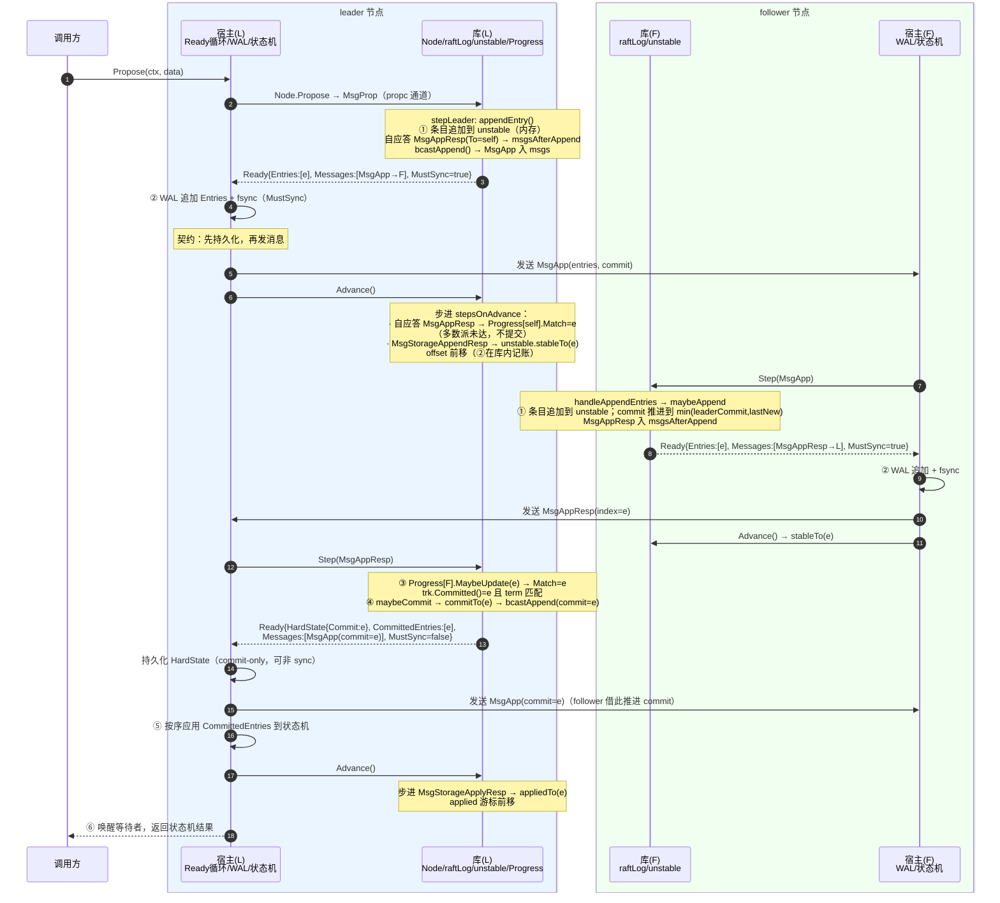

# Raft 提案生命周期：从 Propose 到 Advance 的完整链路（事故复盘与集成审查指南）

> 适用代码：本仓库 `go.etcd.io/raft/v3`（etcd 独立 Raft 库）。
> 文中所有行号均指向当前仓库代码，链接为相对路径，可直接点击跳转。
>
> 本文回答两个线上反复出现的问题：
> 1. **命令已经写进本地 WAL，调用方却迟迟看不到状态机结果** —— 卡在哪一环？
> 2. **节点崩溃重启或更换 leader 后，旧命令被又应用了一次** —— 是库的问题还是宿主的问题？
>
> 结论先行：这两类问题几乎都不是 Raft 安全性被破坏，而是**宿主应用（嵌入 raft 库的存储服务）没有兑现 Ready/Advance 契约**，或者把"WAL 里有日志"误当成了"已提交/已应用"。下文逐层拆解。

---

## 1. 边界：库保证什么，宿主必须兑现什么

Raft 库是一个**纯状态机 + 消息生成器**：它不碰磁盘、不发网络包、不感知调用方的请求通道。它只做三件事：

- 接收消息（`Node.Step` / `RawNode.Step`，本地提案也封装成 `MsgProp` 消息）；
- 在内存里推进 raft 状态（term、vote、log、commit、progress）；
- 通过 `Ready` 把"宿主需要替我干的活"交出来：持久化、发消息、应用日志、装快照。

宿主（存储服务）负责所有副作用：WAL/快照落盘与 fsync、网络收发、状态机应用、把结果通知调用方。

| 职责 | 库保证 | 宿主必须兑现 |
| --- | --- | --- |
| 日志追加 | `appendEntry`/`maybeAppend` 只在内存 `unstable` 上追加/截断；已提交条目永不被覆盖（冲突点 ≤ committed 直接 panic，见 [log.go](../log.go#L119-L128)） | 把 `Ready.Entries` 写入 WAL；**写 index=i 的条目时必须丢弃本地所有 index≥i 的旧条目**（[doc.go](../doc.go#L75-L77)）；`MustSync=true` 时必须 fsync |
| 持久化时机 | 库把"必须落盘后才能发"的响应（`MsgAppResp`/`MsgVoteResp`/`MsgPreVoteResp`，含 leader 自应答）放进 `msgsAfterAppend`，同步模式下经 `Advance` 驱动、异步模式下挂在 `MsgStorageAppend.Responses` 里 | 同步模式：**先持久化 HardState/Entries/Snapshot，再发 `Ready.Messages`**（[node.go Ready 注释](../node.go#L98-L110)、[doc.go](../doc.go#L79-L91)）；异步模式：append 线程 fsync 完成后才能投递 Responses |
| 复制 | leader 用 `Progress.Match/Next` 跟踪每个 follower；follower 在**本地持久化之后**才生成 ack（ack 走 `msgsAfterAppend`） | 可靠、保序（同一条连接）地投递消息；消息丢失要靠 `ReportUnreachable`/心跳恢复 |
| 提交 | `maybeCommit` 只推进**当前 term** 且 Match 达到多数派的 index（[log.go maybeCommit](../log.go#L455-L464)、[tracker.go Committed](../tracker/tracker.go#L177-L181)）；commit 单调不减 | 无。提交判定完全在库内；宿主只能读到结果 |
| 应用 | `CommittedEntries` 保证连续、无空洞、不超过 committed；同步模式下同批条目"先持久化后应用"；异步模式下只投递已 stable 的条目 | **按顺序、不跳过**地应用；应用语义至少一次（at-least-once），状态机必须幂等或把 applied index 与副作用原子持久化；重启时如实设置 `Config.Applied` |
| 应用进度 | 库维护 `applied/applying` 游标，但**不持久化** applied；重启后从 `Config.Applied` 恢复 | 重启时 `Config.Applied` 必须等于状态机真实持久应用位置（[raft.go Config.Applied](../raft.go#L147-L151)） |
| 结果通知 | 库完全不感知"调用方" | 应用 `CommittedEntries` 后由宿主唤醒等待的提案；`Node.Propose` 返回 nil **只代表被 leader 接收追加，不代表提交**，提案可能无声丢失，调用方必须超时重试（[node.go Propose 注释](../node.go#L138-L140)） |
| 快照 | 库生成 `Ready.Snapshot` / `MsgSnap`，恢复时重置 log 与配置 | 同步模式：保存快照到 Storage、把快照数据应用到状态机；`MsgSnap` 发送后必须 `ReportSnapshot`；异步模式由 append 线程落快照后再回响应 |
| 时钟 / 驱动 | 无 | 按固定间隔调用 `Tick()`；持续 drain `Ready()` 并在同步模式下调用 `Advance()`；网络消息及时 `Step()` 回库 |

---

## 2. 关键状态与游标：它们在哪里、由谁推进

### 2.1 一条日志的六个"已 X"状态

| 状态 | 精确定义 | 库内体现 | 崩溃后是否还在 |
| --- | --- | --- | --- |
| **已追加**（appended） | 条目进入本节点 raft 内存日志 | leader：[appendEntry](../raft.go#L812-L847) → `raftLog.append` → [`unstable.truncateAndAppend`](../log_unstable.go#L200-L222)；follower：[`maybeAppend`](../log.go#L109-L131) | 否。仅内存 `unstable.entries` |
| **已持久化**（persisted / stable） | 条目已写入宿主稳定存储且 fsync，库已收到"稳定"确认 | 同步模式：`Advance` 时步进合成的 `MsgStorageAppendResp` → [`raftLog.stableTo`](../log.go#L367) → [`unstable.stableTo`](../log_unstable.go#L138-L164)，`offset` 前移；异步模式：append 线程回 `MsgStorageAppendResp` → `Step` 处理（[raft.go L1197-L1203](../raft.go#L1197-L1203)） | 是（宿主 WAL）。但库内存游标丢失，重启靠 Storage 重建 |
| **已复制**（replicated） | 条目已在某 follower 上**持久化**并被 leader 计入 | follower 持久化后才发 `MsgAppResp`；leader 收到后 [`Progress.MaybeUpdate`](../tracker/progress.go#L205-L213) 推进 `Match` | leader 内存丢失；重启后由 follower 重新 ack 重建 |
| **已提交**（committed） | 条目在多数派节点上持久化，且（leader 侧判定时）属于当前 term | [`raft.maybeCommit`](../raft.go#L775-L779) → `trk.Committed()`（投票成员 Match 的多数派值，learner 不计）→ [`raftLog.commitTo`](../log.go#L322-L330)；follower 经 `MsgApp/MsgHeartbeat` 的 Commit 字段 `commitTo` | 已提交即被多数派 WAL 覆盖，**永不丢失、永不被覆盖**；本节点 committed 靠 HardState.Commit 持久化，丢了也能从 leader 重学 |
| **已应用**（applied） | 条目已交给宿主状态机执行完成 | 同步模式：`Advance` 步进合成的 `MsgStorageApplyResp` → [`raft.appliedTo`](../raft.go#L737-L764)；异步模式：apply 线程回 `MsgStorageApplyResp` → `Step`（[raft.go L1205-L1210](../raft.go#L1205-L1210)） | 库**不持久化**；重启由 `Config.Applied` 重建。状态机副作用是否持久由宿主负责 |
| **调用方已收到结果** | 宿主状态机应用完毕，并唤醒/回复了等待该提案的调用方 | **库内无任何对应状态** | 完全由宿主负责（建议随状态机副作用原子记录请求去重信息） |

> **事故映射**：
> - "WAL 里有、调用方看不到" = 条目处于 ②③④⑤ 任一环节卡住：多数派未 ack（②/③）、commit 消息还没到本节点（④）、`CommittedEntries` 还没被应用（⑤，常见于 apply 线程阻塞、`MaxCommittedSizePerReady` 流控暂停、同步模式下宿主迟迟不 `Advance` 导致库不再产出新 Ready）、或宿主应用后没通知调用方（⑥ 的接线问题）。
> - "重启/换 leader 后又应用一次" = 条目处于 ⑤/⑥ 时崩溃：库按 `Config.Applied` 重新投递 `CommittedEntries`，这是**协议规定的至少一次投递**；幂等/去重是宿主责任。另外，未提交条目（①-③）在换 leader 后可能被新日志覆盖，如果宿主 WAL 追加时不截断冲突尾部，重启后 Storage 会残留旧条目，诱发各种"旧命令复活"的诡异现象。

### 2.2 `unstable` 的 offset / offsetInProgress / stable

[`unstable`](../log_unstable.go#L37-L54) 是"库知道、但还没确认落进宿主 Storage"的日志与快照：

- `entries[i]` 的 raft index = `offset + i`；
- `offset`：第一条 unstable 条目的 index；它之前的日志都在 Storage 里（或被快照压实）；
- `offsetInProgress`：`[offset, offsetInProgress)` 这段**已经通过 Ready 交给宿主、正在落盘**（in-progress），不会再出现在后续 `Ready.Entries` 里（[`nextEntries`](../log_unstable.go#L100-L106)）；`acceptInProgress` 在 `acceptReady` 时推进它（[`acceptUnstable`](../log.go#L371-L375)）；
- `stableTo(index, term)`：宿主落盘完成后调用。**term 必须匹配**才截断前缀并前移 `offset`（[`stableTo`](../log_unstable.go#L138-L164)）；term 不匹配说明这段日志在落盘期间被更高 term 的条目替换过（异步落盘 ABA 场景），本次确认被忽略；
- `snapshot` / `snapshotInProgress`：待安装快照，语义同上；`stableSnapTo` 在快照安装完成后清掉；
- `truncateAndAppend` 三种情况：直接追加 / 从 ≤offset 处整体替换 / 中间截断（冲突回退），并相应回退 `offsetInProgress`（[log_unstable.go L200-L222](../log_unstable.go#L200-L222)）。

### 2.3 committed / applying / applied 三个游标

[`raftLog`](../log.go#L25-L64) 维护：

- `committed`：已知在多数派稳定存储上的最高 index；
- `applying`：已通过 Ready 交给宿主应用的最高 index。在 **`acceptReady` 时**由 [`acceptApplying`](../log.go#L347-L365) 推进——也就是说，同步模式下 Ready 一被接收，库就认为这批条目"正在应用"；
- `applied`：宿主确认应用完成的最高 index，在 `Advance`/`MsgStorageApplyResp` 时由 [`appliedTo`](../log.go#L332-L345) 推进。

不变量：`applied ≤ applying ≤ committed`。`CommittedEntries` 的投递区间是 `(applying, maxAppliableIndex]`（[`nextCommittedEnts`](../log.go#L220-L244)）：

- 同步模式 `allowUnstable=true`：上界 = committed。同批 Ready 的 `Entries` 会先被宿主持久化，所以允许应用 unstable 条目；
- 异步模式 `allowUnstable=false`（[`applyUnstableEntries`](../rawnode.go#L443-L445)）：上界 = `min(committed, unstable.offset-1)`，**只应用已 stable 的条目**，apply 线程永远不会跑到 append 线程前面。
- 有未处理快照时（`hasNextOrInProgressSnapshot`）不投递任何 CommittedEntries，快照优先；
- `applyingEntsPaused`：在途应用字节数达到 `MaxCommittedSizePerReady` 时暂停投递，等 `appliedTo` 释放额度。**这是"已提交但迟迟不应用"的正常原因之一**，不是死锁。

重启初始化（[`newLogWithSize`](../log.go#L75-L100)、[`newRaft`](../raft.go#L439-L498)）：三个游标先置为 `FirstIndex()-1`，再用 HardState.Commit 恢复 committed、用 `Config.Applied` 恢复 applied。

### 2.4 HardState / Entries / CommittedEntries / Messages / Snapshot / MustSync

`Ready` 结构见 [node.go L52-L115](../node.go#L52-L115)，由 [`readyWithoutAccept`](../rawnode.go#L139-L187) 组装：

- **HardState** `{Term, Vote, Commit}`：需持久化的硬状态。Term/Vote 变化**必须 fsync 后才能投票/响应**（库用 `msgsAfterAppend` 强制这个顺序，见 [raft.go send L546-L593](../raft.go#L546-L593)）；Commit 只影响本节点应用进度，丢了可重学。
- **Entries**：待持久化的 unstable 条目（不含 in-progress 部分）。
- **CommittedEntries**：待应用条目（语义见 2.3）。
- **Messages**：出站消息。同步模式下宿主**必须先持久化再发送**；异步模式下网络消息可立即发，而需要持久化前提的响应挂在本地存储消息的 `Responses` 里。
- **Snapshot**：待保存并应用的快照；非空时 Entries/CommittedEntries 为空。
- **MustSync**（[`MustSync`](../rawnode.go#L191-L198)）：`entries 非空 || Term 变化 || Vote 变化` 为 true，宿主必须 fsync；**仅 Commit 推进时为 false**，非 durable 写也可接受。

### 2.5 Progress / Match / Next

leader 侧 [`tracker.Progress`](../tracker/progress.go#L30-L117)（仅 leader 完整使用）：

- `Match`：已知 follower 与 leader 日志一致的最高 index（follower 持久化后 ack 才推进）；
- `Next`：下一条要发送的 index，`(Match, Next)` 为在途区间；状态机三态：`StateProbe`（每心跳周期最多一条探测）、`StateReplicate`（乐观批量推进 Next，Inflights 流控）、`StateSnapshot`（快照发送中，`IsPaused()=true`）；
- [`MaybeUpdate`](../tracker/progress.go#L205-L213)：ack 到达推进 Match；[`MaybeDecrTo`](../tracker/progress.go#L226-L254)：拒绝时回退 Next；[`BecomeSnapshot`](../tracker/progress.go#L153-L158)：挂起 `PendingSnapshot`；
- leader **自己的** Match 不在追加时推进，而是在自应答 `MsgAppResp(To=self)` 被处理时推进——该应答走 `msgsAfterAppend`，即**leader 自己也要等本地 fsync 完成才算一票**（[appendEntry L835-L845](../raft.go#L835-L845)）；
- 提交点：[`ProgressTracker.Committed`](../tracker/tracker.go#L177-L181) 对所有**投票成员**（learner 除外）的 Match 取多数派中位数，再经 `raftLog.maybeCommit` 校验 term 后推进 commit。

---

## 3. 正常提交全链路时序图（同步 Ready/Advance 模式）

下图以"调用方向 leader 提案、3 节点集群"为例，标出库与宿主的边界。`库(L)` 为 leader 节点 raft 库，`宿主(L)` 为 leader 所在存储服务；`库(F)`/`宿主(F)` 为任一 follower。

要点：

1. `Propose` 返回 nil 发生在步骤 2（leader 接收追加），**远早于提交**；follower 上提案会被转发给 leader，转发后可能无声丢失。
2. 步骤 4 的 fsync 是硬性顺序：`MsgAppResp`/`MsgVoteResp` 这类响应在库内被刻意放进 `msgsAfterAppend`（[raft.go send](../raft.go#L546-L601)），同步模式下它们出现在 `Ready.Messages` 中，而契约要求消息在持久化之后才能发。
3. 同步模式下，leader 自己的 Match 在 **`Advance` 时**才推进（[`acceptReady` 收集自应答 → `Advance` 步进](../rawnode.go#L410-L427)）；follower 的 ack 在 `Step(MsgAppResp)` 时推进。两者都以"本地已 fsync"为前提。
4. 步骤 11 之后 commit 才成立；步骤 14 应用；步骤 16 通知调用方。**③④⑤⑥ 任一环节阻塞，调用方都会"看不到结果"**。
5. 同步模式的 `node.run` 在发出一个 Ready 后必须等 `Advance` 才会产出下一个 Ready（[node.go run L435-L446](../node.go#L435-L446)）：宿主若迟迟不 `Advance`，整个节点的 Ready 流水线停摆。库允许"边应用边 Advance"的优化（[node.go Advance 注释](../node.go#L166-L178)），但上一批 CommittedEntries/快照未完成前，不得应用下一批（同文件 NOTE）。

---

## 4. 七类场景对比

### 4.1 正常提交

即第 3 节时序。关键校验测试：

- leader 提交并推进 commit：[raft_paper_test.go `TestLeaderCommitEntry`](../raft_paper_test.go#L397)、[`TestLeaderAcknowledgeCommit`](../raft_paper_test.go#L426)、[`TestLeaderCommitPrecedingEntries`](../raft_paper_test.go#L466)；follower 侧 [`TestFollowerCommitEntry`](../raft_paper_test.go#L497)；
- 只提交当前 term 条目（Figure 8 安全性）：[`TestLeaderOnlyCommitsLogFromCurrentTerm`](../raft_paper_test.go#L752)、[raft_test.go `TestCannotCommitWithoutNewTermEntry`](../raft_test.go#L718)；
- Ready/Advance 基本节奏：[node_test.go `TestNodeAdvance`](../node_test.go#L654)（Advance 后必须能再拿到 Ready）；
- Ready 消费语义（`readyWithoutAccept` 不重置、`Ready()`/`acceptReady` 才移交）：[rawnode_test.go `TestRawNodeConsumeReady`](../rawnode_test.go#L937)。

### 4.2 follower 日志冲突后回退追赶

follower 存在旧 term 的未提交分叉（曾是旧 leader、或网络分区期间投过票）：

1. leader 按 `Progress.Next` 发 `MsgApp`，锚点 `(prevLogIndex, prevLogTerm)` 在 follower 处不匹配；
2. follower [`handleAppendEntries`](../raft.go#L1791-L1833)：`maybeAppend` 失败（`matchTerm` 假），用 [`findConflictByTerm`](../log.go#L182-L194) 算出"我这边 term ≤ 你的 LogTerm 的最大 index"作为 hint，回**拒绝** `MsgAppResp{Reject, RejectHint, LogTerm}`；
3. leader [`stepLeader` MsgAppResp 拒绝分支](../raft.go#L1390-L1517)：[`MaybeDecrTo`](../tracker/progress.go#L226-L254) 回退 Next，`StateReplicate` 降级为 `StateProbe`；leader 侧同样用 `findConflictByTerm` 一次跳过一整个 term，避免逐条探测；
4. 探测到共同前缀后，新 `MsgApp` 携带覆盖段到达 follower：[`maybeAppend`](../log.go#L109-L131) 中 `findConflict` 返回冲突点 `ci`，`ci > committed` 时 `append` → [`unstable.truncateAndAppend`](../log_unstable.go#L200-L222) 截断内存分叉（`offsetInProgress` 相应回退）；
5. **宿主侧关键动作**：这批 `Ready.Entries` 从 `ci` 开始，写 WAL 时必须丢弃 index ≥ ci 的已持久化旧条目。参考实现 [`MemoryStorage.Append`](../storage.go#L293-L326) 用全切片表达式截断 `ms.ents[:offset:offset]` 再追加；契约文字见 [doc.go L75-L77](../doc.go#L75-L77)。

安全性护栏：冲突点 ≤ committed 时库直接 panic（[log.go L120-L121](../log.go#L120-L121)）；`prev.index < committed` 时 follower 直接回 committed index 不做任何截断（[raft.go L1796-L1799](../raft.go#L1796-L1799)）。**已提交条目永远不会被覆盖**。

> 宿主常见错误：WAL 追加时只 append 不截断。重启后 `Storage.LastIndex()/Term()` 混入旧 term 条目，可能让节点在选举/追随时表现异常，或把旧条目当成日志一部分重读。这是"换 leader 后旧命令复活"的根源之一。

测试核对：[log_test.go `TestFindConflict`](../log_test.go#L27)、[`TestFindConflictByTerm`](../log_test.go#L59)、[`TestLogMaybeAppend`](../log_test.go#L199)；[log_unstable_test.go `TestUnstableTruncateAndAppend`](../log_unstable_test.go#L504)；[storage_test.go `TestStorageAppend`](../storage_test.go#L173)（含截断语义）；数据驱动用例 [testdata/probe_and_replicate.txt](../testdata/probe_and_replicate.txt)。

### 4.3 落后节点通过 snapshot 恢复

follower 落后到日志已被压实（`Next-1` 取 term 返回 `ErrCompacted`，或切片取不到条目）：

1. leader [`maybeSendAppend`](../raft.go#L618-L662) 改走 [`maybeSendSnapshot`](../raft.go#L666-L691)：从 `Storage.Snapshot()` 取快照，`pr.BecomeSnapshot(sindex)`（复制暂停，`IsPaused()` 恒真），发 `MsgSnap`；
2. **宿主**负责把快照数据可靠传给 follower；发送结束（成功或失败）必须 `Node.ReportSnapshot`（[node.go L230-L240](../node.go#L230-L240)）——否则 follower 可能永久卡在 StateSnapshot；
3. follower [`handleSnapshot`](../raft.go#L1840-L1855) → [`restore`](../raft.go#L1860-L1942)：快照 index > committed 且本节点在快照 ConfState 中且 term 匹配不上时，[`raftLog.restore`](../log.go#L466-L470)：`committed = snapIndex`，`unstable.restore`（offset=snapIndex+1、entries 清空、挂 snapshot），并按快照 ConfState 重建 ProgressTracker；
4. 下一个 Ready：`Snapshot` 非空，Entries/CommittedEntries 均为空（[log.go L225-L228、L253-L258](../log.go#L225-L228)）。宿主必须：把快照存入 Storage（参考 [`MemoryStorage.ApplySnapshot`](../storage.go#L218-L237)，更旧快照返回 `ErrSnapOutOfDate`）、把快照数据应用到状态机；
5. 同步模式 `Advance` 时合成的响应携带快照 → [`appliedSnap`](../raft.go#L766-L770)：`stableSnapTo` 清 unstable 快照 + `appliedTo(snapIndex)`；异步模式下快照由 `MsgStorageAppend` 携带，append 线程落盘后回 `MsgStorageAppendResp{Snapshot}`，**即使响应 term 较旧也照常应用快照**（快照承载的是已提交、与 term 无关的状态，[raft.go L1175-L1180](../raft.go#L1175-L1180)）；
6. follower 回 `MsgAppResp(lastIndex)`；leader 收到后若 `StateSnapshot` 且 `Match+1 ≥ firstIndex`，直接 `BecomeProbe → BecomeReplicate` 恢复日志复制（[raft.go L1531-L1545](../raft.go#L1531-L1545)，不依赖 PendingSnapshot 精确匹配，允许快照由旁路数据源发送）。若该应答丢失，`ReportSnapshot(SnapshotFinish)` 让 leader 转 Probe（以 PendingSnapshot 为基准），`SnapshotFailure` 则清 PendingSnapshot 稍后重试。

测试核对：[raft_snap_test.go `TestSendingSnapshotSetPendingSnapshot`](../raft_snap_test.go#L36)、[`TestSnapshotFailure`](../raft_snap_test.go#L67)、[`TestSnapshotSucceed`](../raft_snap_test.go#L84)、[`TestSnapshotAbort`](../raft_snap_test.go#L101)；[log_test.go `TestLogRestore`](../log_test.go#L730)、[`TestStableToWithSnap`](../log_test.go#L653)；[node_test.go `TestNodeRestartFromSnapshot`](../node_test.go#L605)；数据驱动用例 [testdata/slow_follower_after_compaction.txt](../testdata/slow_follower_after_compaction.txt)、[testdata/snapshot_succeed_via_app_resp.txt](../testdata/snapshot_succeed_via_app_resp.txt)。

### 4.4 leader 本地持久化后、多数派提交前失去领导权

时间线：条目已在旧 leader WAL（②）并 `stableTo`，但只有少数派复制（③ 未达多数），`committed` 从未推进。随后旧 leader 收到更高 term 的 `MsgApp/MsgHeartbeat/MsgSnap`：

- [`Step`](../raft.go#L1100-L1131) 检测到更高 term → `becomeFollower(term, from)` → [`reset`](../raft.go#L781-L810)：term 更新、Vote 清空、**所有 Progress 重置**（自身 Match=lastIndex）、`uncommittedSize` 清零；**日志不截断**；
- 新 leader 的日志可能在相同 index 上是不同条目。新 leader 的 `MsgApp` 到达后走 4.2 的冲突路径：内存 `unstable` 截断重写，随后 `Ready.Entries` 携带覆盖段，**宿主 WAL 必须截断 index≥ci 的旧条目**；
- 该条目**永远不会被提交**：它不在多数派日志里；库也绝不会把它放进 `CommittedEntries`（commit 从未推进，且已提交区间不可覆盖）。

对调用方的含义：

- `Node.Propose` 早已返回 nil——那只表示"leader 已接收并追加"（[node.go L138-L140](../node.go#L138-L140) 明确：proposal may be lost without notice，重试是调用方责任）；
- 条目可能在 leader 切换/分区期间被丢弃（follower 上无 leader 时 `MsgProp` 直接返回 `ErrProposalDropped`，见 [stepFollower L1720-L1727](../raft.go#L1720-L1727)；leader 上转主、超过 `MaxUncommittedEntriesSize` 也会丢，[appendEntry L822-L829](../raft.go#L822-L829)）；
- **调用方必须带超时重试，并由状态机/宿主做命令去重**（例如请求 ID 幂等表）。重试发生在"条目其实已提交但响应丢失"时，同一条命令会以新 index 再走一遍日志——这正是"旧命令又应用一次"的另一来源，去重必须在宿主状态机层完成。

> 排查要点：事故时若发现"WAL 有该条目但状态机没有"，先核对该 index 的 term 与当前 leader 日志是否一致、commit 是否曾到达该 index。未提交条目被覆盖是**预期行为**，不是数据损坏；数据损坏的判定标准是"已提交条目丢失或被覆盖"，库在该方向上有 panic 护栏。

测试核对：[node_test.go `TestNodeProposeWaitDropped`](../node_test.go#L387)（丢弃语义）、[raft_test.go `TestLeaderElectionOverwriteNewerLogsPreVote`](../raft_test.go#L495)（换 leader 后日志覆盖）、[rawnode_test.go `TestRawNodeBoundedLogGrowthWithPartition`](../rawnode_test.go#L812)（未提交日志限流）。

### 4.5 多数派已提交但状态机尚未应用

时间线：`committed=e` 已在库内推进，`HardState{Commit:e}` 与 `CommittedEntries:[...e]` 已（或即将）进入 Ready，但宿主还没应用完。此时崩溃：

- 条目在多数派 WAL 上，**协议层面绝不丢失**；
- 重启后 [`newRaft`](../raft.go#L439-L498) 从 Storage 重建：committed 来自持久化的 HardState.Commit；即便本节点 commit-only 的 HardState 没 fsync（`MustSync=false`），重启后 leader 的 `MsgApp/MsgHeartbeat` 会重新把 commit 学回来（[`handleHeartbeat`](../raft.go#L1835-L1838)、`maybeAppend` 中的 `commitTo`）；
- applied 来自 `Config.Applied`；库重新投递 `(Applied, committed]` 的全部条目 → **这批条目会被再应用一次**。

库的投递保证：连续、无空洞、不超 committed、快照优先（[`nextCommittedEnts`](../log.go#L220-L244)）；重启行为测试见 [node_test.go `TestNodeRestart`](../node_test.go#L566)（重启后把 committed 但未应用的条目作为 CommittedEntries 投出）。

宿主必须做到其一：

1. 状态机应用天然幂等；或
2. 把"状态机副作用 + applied index（建议含请求去重信息）"在一个原子事务里落盘，重启时用它设置 `Config.Applied`。

`Config.Applied` 报小了 → 重复应用；报大了（超过 committed）→ `appliedTo` panic（[log.go L333-L335](../log.go#L333-L335)）。

另需注意：本场景"卡住但没崩溃"时，先查 apply 线程是否被 `MaxCommittedSizePerReady` 流控暂停（`applyingEntsPaused`，[log.go L347-L365](../log.go#L347-L365)）、是否有未完成的快照阻塞应用、同步模式下是否漏调 `Advance`。分页行为测试：[node_test.go `TestCommitPagination`](../node_test.go#L807)、[`TestNodeCommitPaginationAfterRestart`](../node_test.go#L1018)。

### 4.6 应用完成但 Advance 前进程崩溃（同步模式）

同步模式下 `acceptReady` 一旦把 Ready 交给宿主，`applying` 游标立即推进到本批最后 index（[`acceptApplying`](../log.go#L347-L365)）；而 `applied` 要等 `Advance` 步进合成的 `MsgStorageApplyResp` 才推进（[rawnode.go acceptReady L431-L435、Advance L477-L489](../rawnode.go#L431-L435)）。

崩溃点分析：

- 宿主**已把条目应用到状态机**（副作用已发生甚至已落盘），但还没调 `Advance` 进程就死了：库内 `applying/applied` 全部丢失。重启后库只认 Storage + HardState + `Config.Applied`：
  - 若宿主把 applied index 与副作用原子持久化了 → `Config.Applied=e`，从 e+1 继续，无重复；
  - 若没有（副作用落盘了但 applied 元数据没记，或状态机自己的落盘与记账不在一个事务里）→ 库重新投递 `(applied, committed]`，**旧命令被再应用一次**。
- 这就是"崩溃重启后又应用一次旧命令"最典型的机制：**库从不持久化 applied，也不知道宿主状态机应用到了哪**。它只保证"committed 的条目最终会被投递到应用"，应用的幂等性完全在宿主。

两个相邻陷阱：

- 同步模式允许"边应用边 Advance"（[node.go L166-L178](../node.go#L166-L178)）以避免长快照应用阻塞 Ready；但 Advance 之后若应用线程失败/漏应用，库不会重投（游标已前移）。宿主必须保证应用不丢、不跳过，且下一批 CommittedEntries 的应用严格在上一批完成之后（[node.go Ready 注释 NOTE](../node.go#L162-L164)）。
- 异步模式没有 `Advance`（调用即 panic，[rawnode.go L481-L483](../rawnode.go#L481-L483)），对应确认靠 apply 线程回 `MsgStorageApplyResp`；若 apply 线程丢消息/乱序，`applying` 只增不减、应用额度不释放，最终表现为提交后不再应用——契约要求同目标线程消息**可靠且保序**（[raft.go L163-L167](../raft.go#L163-L167)）。

### 4.7 启用 AsyncStorageWrites 后的处理顺序

开启 `Config.AsyncStorageWrites`（[raft.go L153-L187](../raft.go#L153-L187)）后，Ready 的 `HardState/Entries/Snapshot/CommittedEntries` 字段宿主**不再直接消费**，所有本地存储工作改由 `Ready.Messages` 中的两类本地消息承载（组装逻辑见 [rawnode.go L163-L184](../rawnode.go#L163-L184)）：

- `MsgStorageAppend`（To=`LocalAppendThread`，[`newStorageAppendMsg`](../rawnode.go#L223-L260)）：携带待追加 Entries、HardState（Term/Vote/Commit 字段）、Snapshot；其 `Responses` 里挂着：
  - 所有 `msgsAfterAppend` 消息——即**必须持久化后才能发出**的响应：follower 的 `MsgAppResp`、投票的 `MsgVoteResp/MsgPreVoteResp`、leader 的自应答 `MsgAppResp`；
  - 一个合成的 `MsgStorageAppendResp`（[`newStorageAppendRespMsg`](../rawnode.go#L266-L363)），携带 `(Index, LogTerm, Term)` 用于回告 stable；
- `MsgStorageApply`（To=`LocalApplyThread`，[`newStorageApplyMsg`](../rawnode.go#L372-L382)）：携带 CommittedEntries（保证全部已 stable，见 2.3），响应为 `MsgStorageApplyResp`。

顺序与契约：

1. **网络消息可立即发送**，不等本地落盘（例如 leader 的 `MsgApp` 与 `MsgStorageAppend` 同在一个 Ready，先发给 follower 是安全的——follower 自己会在 fsync 后才 ack）；
2. append 线程必须把 entries/HardState/snapshot **全部 durable（fsync）之后**才能投递 `Responses`；若消息没有 Responses，则不要求持久化（[raft.go L171-L174](../raft.go#L171-L174)）。参考实现：[rafttest/...process_append_thread.go](../rafttest/interaction_env_handler_process_append_thread.go#L48-L82)（先 `processAppend` 落盘，再把 resps 投回网络/节点）；
3. apply 线程应用条目后投递 `MsgStorageApplyResp`；**apply 的写不需要 durable 即可回响应**（状态机可异步落盘，[raft.go L176-L179](../raft.go#L176-L179)）；参考实现：[process_apply_thread.go](../rafttest/interaction_env_handler_process_apply_thread.go#L47-L70)；
4. **同一目标线程的消息必须可靠、保序处理**（不能像网络消息那样丢弃），两个线程之间任意顺序；
5. **禁止调用 `Advance`**（panic）；Ready 发出后 `node.run` 不等待，立即可以产出下一个 Ready（[node.go L437-L441](../node.go#L437-L441)），append/apply 形成流水线；
6. ABA 防护：异步落盘期间 term 可能变化、unstable 日志被替换（旧追加在途、新追加覆盖同 index）。`MsgStorageAppendResp` 携带发出时的 term：回库时若 term 已变小/不匹配，**忽略 stableTo**，不截断 unstable（[raft.go L1166-L1174](../raft.go#L1166-L1174)）；term 匹配才 `stableTo`。每次 term 变化都会发新的 `MsgStorageAppend`，保证最终一定有一个同 term 的响应完成截断（liveness 论证见 [rawnode.go L281-L353 长注释](../rawnode.go#L281-L353)）。快照响应不受 term 影响，照常 `appliedSnap`；
7. 应用额度流控跨 Ready 累计（`MaxCommittedSizePerReady` 约束所有未确认的 MsgStorageApply 在途字节）。

完整顺序可对照数据驱动用例：[testdata/async_storage_writes.txt](../testdata/async_storage_writes.txt)（可见：投票自应答挂在 MsgStorageAppend.Responses 里、fsync 后才投递；commit 后 `MustSync=false` 的 HardState 与 MsgStorageApply 同批出现）与 ABA 场景 [testdata/async_storage_writes_append_aba_race.txt](../testdata/async_storage_writes_append_aba_race.txt)；分页测试 [node_test.go `TestCommitPaginationWithAsyncStorageWrites`](../node_test.go#L855)。宿主循环写法模板见 [doc.go L200-L258](../doc.go#L200-L258)。

---

## 5. 事故复盘 / 集成审查 Checklist

### 5.1 "WAL 有日志，调用方看不到结果"排查路径

1. 该 index 的条目**是否已提交**？查 leader `Status().Progress` 的各 Match 与 `trk.Committed()`；未达多数派即 ③ 未完成，查 follower 连通性、`MsgAppResp` 是否被宿主在 fsync 前吞掉或延迟。
2. 本节点 committed 是否推进？follower 靠 `MsgApp/MsgHeartbeat` 的 Commit 字段推进——查宿主是否因为"先应用再发消息"之类的错误顺序卡住了消息收发。
3. Ready 流水线是否运转？同步模式下宿主是否对每个 Ready 都调用了 `Advance`（漏调会导致库不再产出新 Ready，[node.go run](../node.go#L435-L446)）；异步模式下 append/apply 线程是否存活、是否保序投递 Responses。
4. `CommittedEntries` 是否被流控/快照阻塞？查 `MaxCommittedSizePerReady` 额度（`applyingEntsPaused`）、是否有未完成的 `Ready.Snapshot`。
5. 应用是否真的执行？apply 线程的错误/panic 是否被吞；同步模式"先 Advance 后异步应用"时应用任务是否可能丢失。
6. 应用后通知调用方的接线是否正确？库不负责通知；快照恢复后 applied 跳到 snapIndex，等待旧 index 的提案等待者需由宿主自行唤醒/失败重试。

### 5.2 "重启/换 leader 后旧命令重复应用"排查路径

1. 重复应用的条目 index 是否 ≤ 重启时的 committed？是则属于**协议正常的至少一次投递**：检查宿主幂等/去重与 `Config.Applied` 是否等于状态机持久位置。
2. 状态机副作用与 applied index 是否原子持久化？二者分事务即会在崩溃窗口内重复。
3. WAL 追加是否执行了冲突截断（写 index=i 丢弃 ≥i 旧条目）？对照 [`MemoryStorage.Append`](../storage.go#L313-L324) 自查 Storage 实现。
4. 重复是否来自调用方重试？`Propose` 返回 nil 不等于提交；超时重试需要请求级幂等键。
5. 异步模式下是否错误地提前投递了 `MsgStorageAppend.Responses`（未 fsync 就发 MsgAppResp/投票响应）？这会破坏持久化前提，可能导致已提交条目在重启后丢失——属于安全性事故，不是重复问题，但同源检查。

### 5.3 集成审查清单（宿主侧）

- [ ] 同步模式：每个 Ready 严格按"持久化 HardState/Entries/Snapshot（MustSync 时 fsync）→ 发送 Messages → 应用 Snapshot/CommittedEntries → Advance"处理；写 Entries 时截断冲突尾部。
- [ ] 不在持久化前发送 `Ready.Messages` 中的任何消息（含投票响应）。
- [ ] CommittedEntries 按序、不跳过、不跨批并行应用；上一批（含快照）未完成不应用下一批。
- [ ] 状态机应用幂等，或副作用与 applied index 原子持久化；重启 `Config.Applied` 如实填写。
- [ ] `MsgSnap` 发送后必调 `ReportSnapshot`（成功/失败都要报）。
- [ ] `Tick()` 按固定间隔驱动；网络消息及时 `Step`；`Propose` 超时由调用方重试。
- [ ] 异步模式：不调 `Advance`；两个本地线程各自保序可靠；append 线程 fsync 后才投递 Responses；不自行消费 Ready 的 Entries/HardState/CommittedEntries 字段。
- [ ] Storage 实现满足接口契约：`Entries` 返回切片防追加污染、`Append` 截断语义、`Snapshot` 临时不可用返回 `ErrSnapshotTemporarilyUnavailable`（[storage.go](../storage.go#L42-L96)）。

---

## 6. 关键代码索引

| 主题 | 位置 |
| --- | --- |
| Ready 结构与字段契约 | [node.go L52-L115](../node.go#L52-L115) |
| Node 事件循环（Ready/Advance 握手、异步模式不等待） | [node.go run L343-L454](../node.go#L343-L454) |
| Propose/Step 入口（提案可能丢失） | [node.go L471-L551](../node.go#L471-L551)、[rawnode.go L90-L125](../rawnode.go#L90-L125) |
| Ready 组装 / MustSync / 异步存储消息构造 | [rawnode.go L139-L198](../rawnode.go#L139-L198)、[L200-L395](../rawnode.go#L200-L395) |
| acceptReady / Advance（stepsOnAdvance） | [rawnode.go L400-L489](../rawnode.go#L400-L489) |
| send：msgs 与 msgsAfterAppend 的分流（持久化前提） | [raft.go L514-L601](../raft.go#L514-L601) |
| leader 追加/广播/自应答 | [raft.go appendEntry L812-L847](../raft.go#L812-L847)、[bcastAppend L714-L721](../raft.go#L714-L721) |
| 复制与快照发送 | [raft.go maybeSendAppend L618-L662](../raft.go#L618-L662)、[maybeSendSnapshot L666-L691](../raft.go#L666-L691) |
| 提交判定 | [raft.go maybeCommit L775-L779](../raft.go#L775-L779)、[log.go maybeCommit L455-L464](../log.go#L455-L464)、[tracker.go Committed L177-L181](../tracker/tracker.go#L177-L181) |
| leader 处理 MsgProp/MsgAppResp | [raft.go stepLeader L1294-L1353](../raft.go#L1294-L1353)、[L1384-L1578](../raft.go#L1384-L1578) |
| follower 处理追加/心跳/快照 | [raft.go L1718-L1855](../raft.go#L1718-L1855)、[restore L1860-L1942](../raft.go#L1860-L1942) |
| term 更迭、本地存储响应处理 | [raft.go Step L1089-L1271](../raft.go#L1089-L1271) |
| 日志游标 committed/applying/applied、投递窗口 | [log.go L25-L64](../log.go#L25-L64)、[nextCommittedEnts L220-L273](../log.go#L220-L273)、[appliedTo/acceptApplying L332-L365](../log.go#L332-L365) |
| unstable offset/in-progress/stable/截断 | [log_unstable.go L37-L222](../log_unstable.go#L37-L222) |
| Storage 接口与 MemoryStorage 截断/快照 | [storage.go L42-L96](../storage.go#L42-L96)、[Append L293-L326](../storage.go#L293-L326) |
| Progress 状态机 | [tracker/progress.go L30-L273](../tracker/progress.go#L30-L273) |
| 宿主契约（同步/异步两种循环模板） | [doc.go L69-L145](../doc.go#L69-L145)、[L172-L258](../doc.go#L172-L258) |
| 异步模式参考实现（测试夹具） | [rafttest/process_ready](../rafttest/interaction_env_handler_process_ready.go#L45-L81)、[append 线程](../rafttest/interaction_env_handler_process_append_thread.go#L48-L100)、[apply 线程](../rafttest/interaction_env_handler_process_apply_thread.go#L47-L112) |
