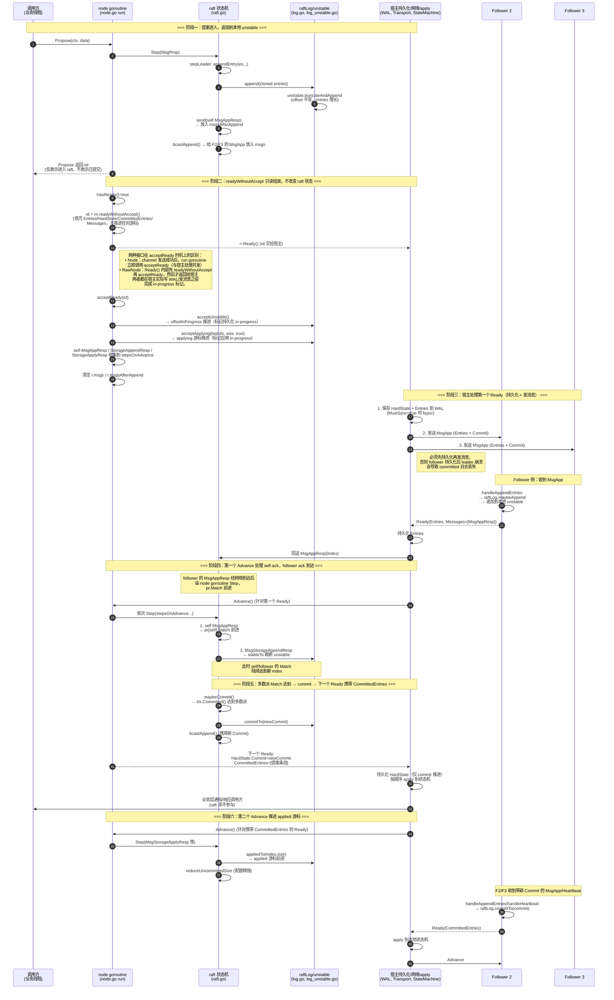

# Raft Ready/Advance 生命周期与提案链路梳理

> 本文基于当前仓库 `go.etcd.io/raft/v3` 的真实实现，梳理一条普通提案从进入 `Node`/`RawNode` 到调用方收到结果的完整链路。适用于事故复盘、集成审查和新人 onboarding。
>
> 对应代码版本：etcd raft v3（本仓库根目录）。

---

## 1. 术语与六重状态

一条提案在其生命周期中会依次经过以下六个语义阶段。理解每个阶段“意味着什么”以及“由谁保证”是排查重复应用、结果丢失、WAL 已落盘但状态机无反应等问题的关键。

| 阶段 | 含义 | 库内位置 | 由谁保证持久性 |
|------|------|----------|----------------|
| **已追加 (Appended to unstable)** | 条目进入了当前节点内存中的 `unstable.entries`，赋予了 index/term，但尚未交给宿主持久化 | [log_unstable.go](file:///e:/newGsb/generated/question-exchange/questions/GSB-003/Athena/log_unstable.go) 的 `truncateAndAppend` | 无（进程崩溃即丢失） |
| **已持久化 (Stable / Durable locally)** | 宿主通过 `Ready.Entries`（或 `MsgStorageAppend`）把条目写入了本地 WAL/Storage，并通过 `Advance` 或 `MsgStorageAppendResp` 告知 raft；raft 将其从 `unstable` 截断 | [log_unstable.go](file:///e:/newGsb/generated/question-exchange/questions/GSB-003/Athena/log_unstable.go#L138-L164) 的 `stableTo` | **宿主必须兑现**：必须在返回响应前完成 fsync 或等价持久化 |
| **已复制 (Replicated to quorum)** | leader 的 `ProgressTracker` 中，多数派选民的 `Progress.Match` 都达到了该 index（[tracker/tracker.go](file:///e:/newGsb/generated/question-exchange/questions/GSB-003/Athena/tracker/tracker.go#L177-L181) 的 `Committed()`） | [raft.go](file:///e:/newGsb/generated/question-exchange/questions/GSB-003/Athena/raft.go#L775-L779) 的 `maybeCommit` | 库通过 Raft 协议保证；网络/存储由宿主提供 |
| **已提交 (Committed)** | 本节点 `raftLog.committed` 游标前进到该 index。这是一个**纯内存**的协议决定，不代表已经落盘或应用 | [log.go](file:///e:/newGsb/generated/question-exchange/questions/GSB-003/Athena/log.go#L322-L330) 的 `commitTo` | 库保证：一旦在某一任期内被多数派复制，日志在任何未来 leader 下都不会被覆盖 |
| **已应用 (Applied)** | 宿主从 `Ready.CommittedEntries`（或 `MsgStorageApply`）取出条目，在状态机上按顺序执行完毕，并通过 `Advance`/`MsgStorageApplyResp` 告知 raft；`raftLog.applied` 前进 | [log.go](file:///e:/newGsb/generated/question-exchange/questions/GSB-003/Athena/log.go#L332-L345) 的 `appliedTo` | **宿主必须兑现**：必须按 index 严格顺序、幂等或至少 exactly-once 地应用 |
| **调用方已收到结果** | 提案的发起者（可能是 leader 本地，也可能是 follower 转发）在自己的业务层观察到了状态机变化或得到了响应。这一阶段 raft 库本身**不提供通知机制**，完全由宿主在 apply 循环中实现 | 宿主代码 | **宿主必须兑现**：raft 只保证“日志最终会被 apply”，不保证“提案调用何时返回” |

关键不变量（见 [log.go:33-49](file:///e:/newGsb/generated/question-exchange/questions/GSB-003/Athena/log.go#L33-L49)）：

```
applied <= applying <= committed
```

- `committed`：多数派已确认的最高 index。
- `applying`：已经通过 `Ready.CommittedEntries` 交给宿主、但宿主尚未确认应用完成的最高 index（`acceptReady` 时推进）。
- `applied`：宿主已确认应用完成的最高 index（`Advance` 或 `MsgStorageApplyResp` 时推进）。

---

## 2. 关键数据结构

### 2.1 HardState

[raft.go:504-510](file:///e:/newGsb/generated/question-exchange/questions/GSB-003/Athena/raft.go#L504-L510)

```go
func (r *raft) hardState() *pb.HardState {
    return &pb.HardState{
        Term:   new(r.Term),
        Vote:   new(r.Vote),
        Commit: new(r.raftLog.committed),
    }
}
```

`HardState{Term, Vote, Commit}` 是 Raft 论文要求所有服务器持久化的状态。它出现在 `Ready.HardState` 中。

- **非 AsyncStorageWrites 模式**：宿主必须在发送 `Ready.Messages` 之前把 `HardState` 和 `Entries` 持久化。
- **AsyncStorageWrites 模式**：`HardState`、`Entries`、`Snapshot`、`CommittedEntries` 这些顶层字段**仍然会被 `readyWithoutAccept` 无条件填充**（见 [rawnode.go:142-161](file:///e:/newGsb/generated/question-exchange/questions/GSB-003/Athena/rawnode.go#L142-L161)），宿主可以读取它们用于观察/调试，但**不应直接依据这些顶层字段执行持久化或应用动作**；同样的数据会被复制进 `Messages` 中的 `MsgStorageAppend`/`MsgStorageApply` 消息，由本地 append/apply 线程按消息驱动处理。若同时按顶层字段和存储消息操作，会导致重复持久化/应用。

`MustSync`（[rawnode.go:191-198](file:///e:/newGsb/generated/question-exchange/questions/GSB-003/Athena/rawnode.go#L191-L198)）指示本次 HardState/Entries 是否必须同步落盘：当 term 变化、vote 变化或有新 entries 时为 true。

### 2.2 Entries vs CommittedEntries

| Ready 字段 | 来源 | 宿主动作 |
|-----------|------|----------|
| `Entries` | `raftLog.nextUnstableEnts()` —— unstable 中尚未开始持久化的条目 | 追加写入 WAL/Storage |
| `CommittedEntries` | `raftLog.nextCommittedEnts(allowUnstable)` —— committed 但尚未交给应用的条目 | 应用到状态机 |

注意：在非 AsyncStorageWrites 模式下，`applyUnstableEntries()` 返回 `true`（[rawnode.go:443-445](file:///e:/newGsb/generated/question-exchange/questions/GSB-003/Athena/rawnode.go#L443-L445)），这意味着 **committed 条目即使还没出现在本地 stable Storage 中，也可以被返回给宿主应用**。这是因为宿主在同一个 Ready 循环里先写 `Entries` 再 apply `CommittedEntries`，raft 信任宿主会遵守这个顺序。而在 AsyncStorageWrites 模式下，apply 线程独立于 append 线程，只有已 stable 的条目才允许被 apply（`allowUnstable=false`）。

### 2.3 Messages

`Ready.Messages` 包含需要发往其他节点的出站消息。raft 内部将消息分成两类（[raft.go:364-379](file:///e:/newGsb/generated/question-exchange/questions/GSB-003/Athena/raft.go#L364-L379)）：

- **`r.msgs`**：可以立即发送的消息（`MsgApp`、`MsgHeartbeat`、`MsgVote` 等发给其他节点的消息）。
- **`r.msgsAfterAppend`**：必须等本地 unstable 状态（term/vote/entries）**持久化之后**才能发送的消息，主要是响应类消息：
  - `MsgAppResp`（follower/leader 自我确认日志已落盘）
  - `MsgVoteResp` / `MsgPreVoteResp`（投票响应）

`raft.send()`（[raft.go:514-600](file:///e:/newGsb/generated/question-exchange/questions/GSB-003/Athena/raft.go#L514-L600)）根据消息类型决定放入哪个切片。这一区分直接对应 Raft 论文 §3.8 的持久化要求。

在非 AsyncStorageWrites 模式下，`msgsAfterAppend` 中发给自身的消息（如 leader 自己的 `MsgAppResp`）在 `acceptReady` 时被收集到 `stepsOnAdvance`，在 `Advance()` 时由 raft 自己 Step（[rawnode.go:410-427](file:///e:/newGsb/generated/question-exchange/questions/GSB-003/Athena/rawnode.go#L410-L427)、[rawnode.go:477-489](file:///e:/newGsb/generated/question-exchange/questions/GSB-003/Athena/rawnode.go#L477-L489)）。发给其他节点的则在 `readyWithoutAccept` 时被提升到 `Ready.Messages`（[rawnode.go:179-183](file:///e:/newGsb/generated/question-exchange/questions/GSB-003/Athena/rawnode.go#L179-L183)），但文档契约要求宿主**必须在持久化 Entries 之后再发送 Messages**。

### 2.4 Snapshot

`Ready.Snapshot` 携带需要保存到 stable storage 的快照。当 follower 严重落后、leader 的 retained log 已经覆盖不到其 Next 索引时，leader 会发送 `MsgSnap`（[raft.go:664-691](file:///e:/newGsb/generated/question-exchange/questions/GSB-003/Athena/raft.go#L664-L691)）。follower 收到后通过 `handleSnapshot` → `raftLog.restore` 将快照放入 `unstable.snapshot`（[raft.go:1840-1855](file:///e:/newGsb/generated/question-exchange/questions/GSB-003/Athena/raft.go#L1840-L1855)、[log_unstable.go:192-198](file:///e:/newGsb/generated/question-exchange/questions/GSB-003/Athena/log_unstable.go#L192-L198)），在下一个 Ready 中暴露给宿主持久化和恢复状态机。

宿主应用快照后，必须确保：状态机恢复到 snapshot.Metadata.Index 的状态，且后续不会重复应用该 index 之前的条目。

### 2.5 unstable 的 offset / offsetInProgress / stable

[log_unstable.go:37-54](file:///e:/newGsb/generated/question-exchange/questions/GSB-003/Athena/log_unstable.go#L37-L54)

```go
type unstable struct {
    snapshot           *pb.Snapshot
    entries            []*pb.Entry
    offset             uint64  // entries[0] 的 log index
    snapshotInProgress bool
    offsetInProgress   uint64  // entries[:offsetInProgress-offset] 正在被持久化
}
```

- `offset`：`entries` 切片中第一条的日志索引。持久化完成后，`stableTo` 会前进 `offset` 并截断已持久化的前缀。
- `offsetInProgress`：标记“已经通过 Ready 交给宿主、正在持久化过程中”的边界。`nextEntries()` 只返回 `entries[offsetInProgress-offset:]`，避免同一条目被重复放入两个 Ready。
- `acceptInProgress()`：在 `acceptReady` 时被调用（[log.go:375](file:///e:/newGsb/generated/question-exchange/questions/GSB-003/Athena/log.go#L375)），把当前所有 entries 标记为 in-progress。
- `stableTo(id)`：在宿主确认持久化后被调用，校验 (index, term) 匹配后截断 entries。

**ABA 防护**：在 AsyncStorageWrites 模式下，`MsgStorageAppendResp` 携带 `(Index, LogTerm, Term)`（[rawnode.go:266-363](file:///e:/newGsb/generated/question-exchange/questions/GSB-003/Athena/rawnode.go#L266-L363)）。如果响应返回时 term 已变（期间发生过领导权更迭/日志截断覆盖），则该响应被忽略，unstable 不会被错误截断（[raft.go:1166-1186](file:///e:/newGsb/generated/question-exchange/questions/GSB-003/Athena/raft.go#L1166-L1186)）。这一机制在非 async 模式下由 `Advance` 的同步语义天然避免。

### 2.6 Progress / Match / Next

[tracker/progress.go:30-117](file:///e:/newGsb/generated/question-exchange/questions/GSB-003/Athena/tracker/progress.go#L30-L117)

leader 为每个 follower 维护一个 `Progress`：

- `Match`：已知该 follower 日志与 leader 匹配的最高 index（持久化后确认）。
- `Next`：下一次要发送的日志 index。区间 `(Match, Next)` 内的条目处于 in-flight。
- `State`：`StateProbe`（探测，每次最多一条）、`StateReplicate`（乐观批量复制）、`StateSnapshot`（正在发快照，暂停日志复制）。
- `Inflights`：滑动窗口，限制在途消息数/字节数。
- `sentCommit`：已发送给该 follower 的最高 commit index，避免重复发送相同的 commit 推进。

`ProgressTracker.Committed()` 通过 quorum 计算所有选民 Match 索引的中位数（[tracker/tracker.go:177-181](file:///e:/newGsb/generated/question-exchange/questions/GSB-003/Athena/tracker/tracker.go#L177-L181)），这是 leader 推进 `raftLog.committed` 的依据。

---

## 3. 正常提案完整时序图

以下时序图展示非 AsyncStorageWrites（经典同步 Ready/Advance）模式下，三节点集群中一条提案从 leader 本地 `Propose` 到各节点 apply 的完整过程。虚线以上为 raft 库内部，虚线以下为宿主应用责任。



---

## 4. 宿主集成契约（库保证 vs 宿主必须兑现）

### 4.1 库本身保证的

1. **选举安全性**：某一任期内最多一个 leader。
2. **Leader 只追加不覆盖**：leader 永远不会覆盖或删除自己日志中的条目，只会追加。
3. **日志匹配特性**：如果不同日志中的两条条目拥有相同的 index 和 term，则它们存储的命令相同，且该 index 之前的所有条目也相同。
4. **Leader 完整提交**：已提交的条目在所有未来 leader 中都存在。
5. **状态机安全**：如果某节点已将 index 为 i 的条目应用到状态机，其他节点不会在同一 index 应用不同条目。
6. **游标单调**：`committed`、`applying`、`applied` 只增不减（[log.go:323](file:///e:/newGsb/generated/question-exchange/questions/GSB-003/Athena/log.go#L323)、[log.go:333-335](file:///e:/newGsb/generated/question-exchange/questions/GSB-003/Athena/log.go#L333-L335)）。
7. **同一 Ready 中**：`CommittedEntries` 的 index 都不超过 `HardState.Commit`。

### 4.2 宿主应用必须兑现的

1. **持久化顺序**：非 async 模式下，必须**先**把 `HardState` 和 `Entries` 写入稳定存储（并在 `MustSync=true` 时 fsync），**再**发送 `Messages`。否则违反 Raft 论文 §3.8，可能造成已复制到 follower 的条目在 leader 重启后丢失，进而引发已提交条目被覆盖。
2. **Advance 时机**：必须在处理完上一个 Ready 后才调用 `Advance()`。`Advance` 后 raft 才会推进 unstable 截断、applied 游标并释放配额；过早或重复调用会导致状态错乱。
3. **Apply 顺序与幂等**：`CommittedEntries` 必须按 index 严格升序应用。崩溃重启后，宿主需要通过 `Config.Applied` 告知 raft 已应用到哪个 index（[raft.go:484-486](file:///e:/newGsb/generated/question-exchange/questions/GSB-003/Athena/raft.go#L484-L486)），否则 raft 可能把已应用的条目再次下发——这正是“崩溃重启后重复应用旧命令”的直接原因。
4. **Snap 状态恢复**：应用 `Snapshot` 时，必须把状态机恢复到 snapshot metadata 的 index/term，并持久化 snapshot；之后不能再 apply 该 index 之前的条目。
5. **提案结果通知**：raft 的 `Propose` 返回 nil **只表示提案被受理**（甚至可能在 leader 切换时静默丢失，见 [node.go:138-140](file:///e:/newGsb/generated/question-exchange/questions/GSB-003/Athena/node.go#L138-L140) 的注释）。调用方何时看到结果完全依赖宿主在 apply 循环中通过条目自身的 id/channel 回传。如果 apply 循环阻塞、落后或漏通知，就会出现“WAL 里有但调用方看不到结果”。
6. **ReportSnapshot**：宿主发送快照到 follower（可能走外部数据流）成功或失败后，必须调用 `ReportSnapshot(id, status)`，否则该 follower 的 Progress 会永久停在 `StateSnapshot`，不再接收日志（[node.go:230-240](file:///e:/newGsb/generated/question-exchange/questions/GSB-003/Athena/node.go#L230-L240)、[raft.go:1611-1628](file:///e:/newGsb/generated/question-exchange/questions/GSB-003/Athena/raft.go#L1611-L1628)）。
7. **Tick 驱动**：选举超时、心跳、检查法定人数都依赖宿主定期调用 `Tick()`（或 `RawNode.Tick()`）。Tick 缺失会导致 leader 无法维持、follower 不发起选举。
8. **消息不可变**：传给 `Step` 的消息和从 Ready 取出的 Entries 都不能被宿主修改（[raft.go:1086-1088](file:///e:/newGsb/generated/question-exchange/questions/GSB-003/Athena/raft.go#L1086-L1088)、[storage.go:63-66](file:///e:/newGsb/generated/question-exchange/questions/GSB-003/Athena/storage.go#L63-L66)）。

---

## 5. 各场景深度分析

### 5.1 正常提交（三节点，leader 提案）

完整流程见第 3 节时序图。关键点：

- leader 在 `appendEntry` 时给自己发一条自定向的 `MsgAppResp`（[raft.go:845](file:///e:/newGsb/generated/question-exchange/questions/GSB-003/Athena/raft.go#L845)），这条消息进入 `msgsAfterAppend`，因为它必须等本地条目持久化后才能被处理（否则 leader 会在自己还没落盘时就把 Match 推进、甚至推动 commit）。
- `acceptReady` 时，自定向的 `MsgAppResp` 和合成的 `MsgStorageAppendResp`/`MsgStorageApplyResp` 被收集到 `stepsOnAdvance`（[rawnode.go:414-426](file:///e:/newGsb/generated/question-exchange/questions/GSB-003/Athena/rawnode.go#L414-L426)）。
- `Advance()` 时这些消息被 Step，leader 才真正把自己的 `Progress.Match` 推进到新 index，随后 `maybeCommit` 结合其他 follower 的响应计算 commit。
- follower 侧的 `MsgAppResp` 在持久化后由宿主通过网络回送；这些响应到达 leader 后直接进入 `stepLeader` 的 `MsgAppResp` 分支。
- 一次提案通常经历**两个 Ready 周期**：第一个 Ready 携带 `Entries`（发给 follower），其 `Advance` 处理 self `MsgAppResp`（推进 self Match）和 `MsgStorageAppendResp`（`stableTo`）；当多数派 Match 达到后 `maybeCommit` 推进 committed，第二个 Ready 携带 `HardState.Commit` 和 `CommittedEntries`，其 `Advance` 处理 `MsgStorageApplyResp`（`appliedTo`，释放配额）。follower 的 ack 可能在第一个 Advance 之前或之后到达，只要合计达到多数派即可推进 commit。

测试参考：[testdata/single_node.txt](file:///e:/newGsb/generated/question-exchange/questions/GSB-003/Athena/testdata/single_node.txt)、[testdata/lagging_commit.txt](file:///e:/newGsb/generated/question-exchange/questions/GSB-003/Athena/testdata/lagging_commit.txt)。

### 5.2 Follower 日志冲突后回退追赶

当 leader 发给 follower 的 `MsgApp` 中 `(prevLogIndex, prevLogTerm)` 在 follower 本地不匹配时，follower 拒绝并返回冲突提示。

**Follower 侧**（[raft.go:1791-1833](file:///e:/newGsb/generated/question-exchange/questions/GSB-003/Athena/raft.go#L1791-L1833)）：

1. `maybeAppend` 调用 `matchTerm(prev)` 失败，返回 `(0, false)`。
2. follower 不直接用 `prev.index` 作为拒绝 hint，而是调用 `findConflictByTerm(min(prevIndex, lastIndex), prevTerm)`（[log.go:182-194](file:///e:/newGsb/generated/question-exchange/questions/GSB-003/Athena/log.go#L182-L194)），找到本节点日志中 term 不大于 leader prevTerm 的最大 index，把它作为 `RejectHint` 连同该位置的 `LogTerm` 一起返回。这一优化避免了在存在大段分歧日志时逐条探测。

**Leader 侧**（[raft.go:1390-1517](file:///e:/newGsb/generated/question-exchange/questions/GSB-003/Athena/raft.go#L1390-L1517)）：

1. 收到 reject 后，如果 `LogTerm > 0`，leader 也用 `findConflictByTerm(rejectHint, logTerm)` 在自己的日志里找到 term 不大于 follower 端 term 的位置，直接把 `Next` 降到那里。
2. `pr.MaybeDecrTo(rejected, nextProbeIdx)` 调整 Next。
3. 如果之前是 `StateReplicate`，降级为 `StateProbe`（乐观复制失效，需要逐条探测）。
4. 立即 `sendAppend(to)` 用新的 Next 重试。

当探测成功（follower 返回非拒绝的 `MsgAppResp`），`MaybeUpdate` 推进 Match，`BecomeReplicate` 恢复批量复制。

**对 unstable 的影响**：冲突条目如果在 follower 的 unstable 中，`maybeAppend` → `append` → `unstable.truncateAndAppend` 会截断冲突后缀（[log_unstable.go:200-222](file:///e:/newGsb/generated/question-exchange/questions/GSB-003/Athena/log_unstable.go#L200-L222)）。如果冲突条目已经持久化（在 stable Storage 中），宿主在 append 新条目时也必须截断 Storage 中的冲突后缀。这是 `Storage.Append` 实现者的责任——参考 [storage.go:313-325](file:///e:/newGsb/generated/question-exchange/questions/GSB-003/Athena/storage.go#L313-L325) 中 MemoryStorage 的处理。

**事故关联**：如果宿主的 Storage.Append 没有正确截断冲突后缀，会导致同一 index 下残留旧 term 的条目，后续 term 校验可能出现诡异不一致。

### 5.3 落后节点通过 Snapshot 恢复

触发条件：leader 调用 `maybeSendAppend` 时，`r.raftLog.term(pr.Next-1)` 返回 `ErrCompacted` 或 `ErrUnavailable`，即 follower 的 Next 已经落后到 leader 日志快照点之前（[raft.go:625-648](file:///e:/newGsb/generated/question-exchange/questions/GSB-003/Athena/raft.go#L625-L648)）。

流程：

1. leader 从 `raftLog.snapshot()` 取出快照（优先 unstable.snapshot，否则 Storage.Snapshot）。
2. `pr.BecomeSnapshot(sindex)`：Progress 进入 `StateSnapshot`，`PendingSnapshot=sindex`，`Next=sindex+1`，复制暂停。
3. 发出 `MsgSnap`。宿主可能通过独立通道（如其他文件传输服务）把快照数据发给 follower；raft 消息本身只携带 snapshot 元数据和可能的内联数据。
4. follower 收到 `MsgSnap`：`handleSnapshot` → `restore(s)`（[raft.go:1860-1928](file:///e:/newGsb/generated/question-exchange/questions/GSB-003/Athena/raft.go#L1860-L1928)）。
   - 如果 snapshot index <= committed，忽略（过期快照）。
   - 如果本地日志在该 (index, term) 已匹配，只快进 commit，不恢复。
   - 否则 `raftLog.restore(s)` 重置 unstable：offset 设为 snapshotIndex+1，清空 entries，设置 snapshot。
   - 通过 `confchange.Restore` 重建 ProgressTracker。
5. follower 在下一个 Ready 中把 Snapshot 暴露给宿主；宿主必须恢复状态机和持久化快照。
6. follower 回复 `MsgAppResp`，index 为 `raftLog.lastIndex()`（即 snapshot index）。
7. leader 收到响应：
   - 如果 `pr.Match+1 >= raftLog.firstIndex()`，说明可以从日志追赶了，`BecomeProbe` → `BecomeReplicate` 恢复复制（[raft.go:1531-1545](file:///e:/newGsb/generated/question-exchange/questions/GSB-003/Athena/raft.go#L1531-L1545)）。
   - 如果外部快照发送失败，宿主调用 `ReportSnapshot(id, SnapshotFailure)`，leader 把 PendingSnapshot 清零并回到 Probe，稍后重试日志或快照（[raft.go:1618-1624](file:///e:/newGsb/generated/question-exchange/questions/GSB-003/Athena/raft.go#L1618-L1624)）。

测试参考：[testdata/snapshot_succeed_via_app_resp.txt](file:///e:/newGsb/generated/question-exchange/questions/GSB-003/Athena/testdata/snapshot_succeed_via_app_resp.txt)、[testdata/slow_follower_after_compaction.txt](file:///e:/newGsb/generated/question-exchange/questions/GSB-003/Athena/testdata/slow_follower_after_compaction.txt)。

**事故关联**：宿主忘记 `ReportSnapshot` 失败会导致 follower 永远卡在 StateSnapshot，日志复制停滞。

### 5.4 Leader 本地持久化后、多数派提交前失去领导权

场景：leader 把条目追加到本地 unstable 并通过 Ready 交给宿主持久化，宿主写了 WAL 但尚未等 follower 确认，此时 leader 崩溃或被更高 term 的消息赶下台。

关键行为：

- 该条目在 leader 的 WAL 中确实存在，但**从未被 committed**（因为多数派 Match 未达到）。
- 当该节点重新加入集群时：
  - 如果它以 follower 身份回归，新 leader 可能在同一 index 有不同 term 的条目。新 leader 的 `MsgApp` 会触发 follower 端冲突处理，`unstable.truncateAndAppend` 截断未提交的旧条目；如果旧条目已在 stable Storage 中，宿主的 `Append` 必须截断它们。
  - 如果它重新当选 leader（不太可能，因为其他节点的日志可能更新；Raft 的 `isUpToDate` 检查会阻止日志不够新的候选者当选，[log.go:442-445](file:///e:/newGsb/generated/question-exchange/questions/GSB-003/Athena/log.go#L442-L445)），它会在 `becomeLeader` 时追加一条当前 term 的空条目（noop，[raft.go:961-965](file:///e:/newGsb/generated/question-exchange/questions/GSB-003/Athena/raft.go#L961-L965)），并通过 `reset` 把所有 Progress 的 Match 重置为 0、Next 设为 lastIndex+1（[raft.go:795-805](file:///e:/newGsb/generated/question-exchange/questions/GSB-003/Athena/raft.go#L795-L805)）。随后新 leader 会通过 append 一致性检查让旧的未提交条目在多数派上被覆盖或保留——但由于它们在旧 term，且新 term 的 noop 被提交前不会被提交，所以不会出现旧条目被错误提交。
- **宿主侧注意**：该条目**永远不会出现在 `CommittedEntries` 中**。如果宿主的业务逻辑在“WAL 落盘”时就通知调用方成功，就会出现“WAL 有但状态机永远不会应用”的假象。正确做法是**只在 apply 时通知结果**。

在 AsyncStorageWrites 模式下，这一场景还涉及 ABA 问题（见 5.7 和 [rawnode.go:281-354](file:///e:/newGsb/generated/question-exchange/questions/GSB-003/Athena/rawnode.go#L281-L354) 的长注释）。旧任期的 `MsgStorageAppendResp` 在 term 变更后会被忽略，unstable 不会被错误截断。

### 5.5 多数派已提交但状态机尚未应用

场景：`raftLog.committed` 已前进，但 `CommittedEntries` 还在 Ready 通道里排队，或宿主的 apply 循环处理缓慢/卡住。

表现：

- 对 leader 而言，`maybeCommit` 已经返回 true，已通过 `MsgApp`/`MsgHeartbeat` 把 commit index 广播给 follower。
- 对本节点而言，`raftLog.applied < raftLog.committed`。
- `Ready.CommittedEntries` 会持续包含这些条目直到它们被 accept 并 apply。
- `hasUnappliedConfChanges()` 在存在未应用的配置变更时会阻止节点发起选举（[raft.go:983-1021](file:///e:/newGsb/generated/question-exchange/questions/GSB-003/Athena/raft.go#L983-L1021)），这是为了保证配置变更的安全。
- 如果此时进程崩溃：
  - committed 信息在 HardState 中已持久化（commit 字段）。
  - 重启时 `newRaft` 从 Storage 加载 HardState，`raftLog.committed` 会恢复；但 `applied` 通过 `Config.Applied` 由宿主告知。
  - 如果宿主正确记录了 applied index，重启后 raft 会重新下发 `(applied+1 .. committed)` 区间的条目；宿主需要去重/幂等应用。
  - 如果宿主**没有**正确记录 applied index（例如把 Applied 设为 0 或错误值），raft 会把已经应用过的条目再次放入 CommittedEntries——这就是“崩溃重启后重复应用旧命令”的根本原因之一。

**排查要点**：检查 `Config.Applied` 是否从状态机的真实持久化 applied index 初始化；检查 apply 循环是否在节点重启时正确去重。

### 5.6 应用完成后、Advance 前进程崩溃

场景：宿主已经把 `CommittedEntries` 应用到状态机（状态机已持久化结果），但还没来得及调用 `Advance()`（非 async 模式）进程就崩溃了。

重启后：

- raft 从 Storage 恢复 HardState 和日志；`committed` 不变。
- 宿主用真实的 `applied` index 初始化 `Config.Applied`。
- 由于 raft 的 `applied` 会被设置为宿主传入的值，已应用的条目不会再次下发。
- 如果宿主**没有**持久化 applied index（只在内存里记录），那么重启后 raft 不知道这些条目已经被应用，会再次把它们放在 CommittedEntries 中。这要求状态机应用必须是幂等的，或者宿主必须在应用条目前后持久化 applied index。

**在非 async 模式下**，`acceptReady` 已经推进了 `applying` 游标，但 `applied` 游标要等 `Advance` 时才通过 `appliedTo` 推进。如果在 acceptReady 和 Advance 之间崩溃，raft 重启后内存状态丢失，`applying` 也不会持久化，所以只要 `Config.Applied` 正确就安全。

**在 AsyncStorageWrites 模式下**，apply 线程独立处理 `MsgStorageApply`，处理完成后回送 `MsgStorageApplyResp`，raft 在收到该响应时才调用 `appliedTo`（[raft.go:1205-1210](file:///e:/newGsb/generated/question-exchange/questions/GSB-003/Athena/raft.go#L1205-L1210)）。如果 apply 线程完成应用但回送响应前崩溃，重启后同样依赖宿主的 applied index 防重。

**核心结论**：raft 库**不持久化 applied index**。applied 是宿主状态机的责任。库只在内存中维护 applied 游标用于决定下次下发哪些条目。任何“重复应用”事故都应首先排查宿主 applied index 的持久化和重启恢复逻辑。

### 5.7 启用 AsyncStorageWrites 后的处理顺序

AsyncStorageWrites 模式（`Config.AsyncStorageWrites=true`）将持久化和应用从 Ready 的同步契约中解耦，改为通过内部消息驱动两个独立线程。这一模式下**禁止调用 `Advance()`**（[rawnode.go:481-483](file:///e:/newGsb/generated/question-exchange/questions/GSB-003/Athena/rawnode.go#L481-L483)、[node.go:176-178](file:///e:/newGsb/generated/question-exchange/questions/GSB-003/Athena/node.go#L176-L178)）。

Ready 组装差异（[rawnode.go:163-184](file:///e:/newGsb/generated/question-exchange/questions/GSB-003/Athena/rawnode.go#L163-L184)）：

- `Ready.Entries`、`Ready.HardState`、`Ready.Snapshot`、`Ready.CommittedEntries` 这些顶层字段**仍会像非 async 模式一样被 `readyWithoutAccept` 无条件填充**（[rawnode.go:142-161](file:///e:/newGsb/generated/question-exchange/questions/GSB-003/Athena/rawnode.go#L142-L161)），宿主可以读取它们用于观察/日志，但**不应直接依据它们执行持久化或应用**；同样的数据会被复制进下面的存储消息，宿主应按消息驱动处理，避免对同一批条目操作两次。
- 如果需要持久化，raft 合成一条 `MsgStorageAppend`（目标 `LocalAppendThread`），把 Entries/HardState/Snapshot 放进去，并把所有 `msgsAfterAppend` 作为 `Responses` 挂在该消息上。
- 如果有 committed entries，raft 合成一条 `MsgStorageApply`（目标 `LocalApplyThread`），把 CommittedEntries 放进去，并挂一条 `MsgStorageApplyResp` 作为响应。
- 这些本地存储消息和普通网络消息一起出现在 `Ready.Messages` 中。宿主需要：
  - 把 `To=LocalAppendThread` 的消息交给 append 线程（写 WAL）。
  - 把 `To=LocalApplyThread` 的消息交给 apply 线程（应用状态机）。
  - 其他消息通过网络发送（可以立即发送，不需要等持久化完成，因为依赖持久化的响应都挂在 StorageAppend 的 Responses 上）。
- 与非 async 模式不同，`acceptReady` 在 async 模式下**不会**填充 `stepsOnAdvance`（[rawnode.go:410-427](file:///e:/newGsb/generated/question-exchange/questions/GSB-003/Athena/rawnode.go#L410-L427)），self-MsgAppResp 和存储响应都被挂到存储消息的 `Responses` 上；但 `acceptUnstable()`/`acceptApplying()` 仍会被调用，in-progress 标记照常推进。

Append 线程处理完 `MsgStorageAppend` 后，必须把 `m.Responses` 中的所有消息逐条交回 raft 的 `Step`（在 node goroutine 中，或宿主保证线程安全的等价方式）。这些响应包括：

- 发往其他节点的 `MsgAppResp`/`MsgVoteResp`（等本地持久化后才真正发出）。
- 自定向的 `MsgAppResp`（leader 自我推进 Match）。
- `MsgStorageAppendResp`（通知 raft unstable 可以截断）。

Apply 线程处理完 `MsgStorageApply` 后，回送 `MsgStorageApplyResp`，raft 收到后推进 `applied` 并释放 uncommitted 配额。

**顺序差异总结**：

| 步骤 | 非 async（经典） | AsyncStorageWrites |
|------|------------------|--------------------|
| 持久化与发消息顺序 | 宿主必须先存后发 | 消息可立即发；依赖持久化的响应被挂起，由 append 线程在落盘后回送 |
| apply 与 append 顺序 | 同一 Ready 中先 append 后 apply；允许 apply unstable entries | append 线程和 apply 线程独立；apply 只看到已 stable 的条目（`allowUnstable=false`） |
| 推进 applied | `Advance()` 时统一推进 | 每条 `MsgStorageApplyResp` 独立推进 |
| unstable 截断 | `Advance()` 时 Step `MsgStorageAppendResp` | append 线程回送 `MsgStorageAppendResp` 时截断 |
| ABA 防护 | 同步 Advance 天然避免 | 通过 `MsgStorageAppendResp.Term` 校验，term 变更则忽略 |

**pipeline 效果**：测试 [testdata/async_storage_writes.txt](file:///e:/newGsb/generated/question-exchange/questions/GSB-003/Athena/testdata/async_storage_writes.txt) 展示了多个 append 可以在途（in-progress）而不需要等待前一个完成。`unstable.offsetInProgress` 持续前进，而 `offset` 在响应回来后才追赶。测试中还可以看到 `"entry at index 15 missing from unstable log; ignoring"` 日志（第 794、797、869 行），这正是 ABA 防护在 term 未变但 unstable 已因其他路径被截断时的正常表现。

**事故关联**：

- 宿主如果在 async 模式下错误地调用 `Advance()`，会 panic。
- 宿主如果没有把 `MsgStorageAppend.Responses` 全部回交给 raft，会导致 follower 的 `MsgAppResp` 永远发不出去、leader 的 self-Match 永远不推进，进而 commit 卡住。
- append 线程和 apply 线程的回送消息必须通过 raft 的 `Step` 串行处理（通常在 node goroutine 中），不能并发调用 raft，因为 raft 状态机不是线程安全的。

---

## 6. Ready → acceptReady → Advance 内部动作对照

以非 async 模式为例，一次 Ready 循环中 raft 内部状态变化如下。注意 `acceptReady` 发生在 Ready 交给宿主**之时**（而非宿主处理完之后），这是容易搞错的地方：

| 时机 | 函数/位置 | 动作 |
|------|-----------|------|
| `HasReady()` | [rawnode.go:448-470](file:///e:/newGsb/generated/question-exchange/questions/GSB-003/Athena/rawnode.go#L448-L470) | 检查 SoftState/HardState 变化、unstable entries/snapshot、committed entries、msgs、readStates |
| `readyWithoutAccept()` | [rawnode.go:139-187](file:///e:/newGsb/generated/question-exchange/questions/GSB-003/Athena/rawnode.go#L139-L187) | 只读地组装 Ready（填充顶层 Entries/HardState/Snapshot/CommittedEntries/Messages）；**不改变 raft 状态、不推进任何游标** |
| Ready 交给宿主 | `<-n.Ready()`（Node）或 `rn.Ready()` 返回（RawNode） | 宿主拿到 Ready 后开始处理：存 HardState/Entries/Snapshot、发 Messages、apply CommittedEntries |
| `acceptReady(rd)` | [rawnode.go:400-438](file:///e:/newGsb/generated/question-exchange/questions/GSB-003/Athena/rawnode.go#L400-L438) | **在宿主收到 Ready 的同时即执行**：Node 在 `readyc <- rd` 成功后于 run goroutine 中调用（[node.go:435-436](file:///e:/newGsb/generated/question-exchange/questions/GSB-003/Athena/node.go#L435-L436)）；RawNode 则在 `Ready()` 返回前调用（[rawnode.go:131-135](file:///e:/newGsb/generated/question-exchange/questions/GSB-003/Athena/rawnode.go#L131-L135)）。更新 prevSoftSt/prevHardSt、清空 readStates；把 self-msgsAfterAppend 和合成的 Storage 响应收集到 stepsOnAdvance；清空 r.msgs/r.msgsAfterAppend；`raftLog.acceptUnstable()` 推进 offsetInProgress；`acceptApplying()` 推进 applying 游标和 applyingEntsSize |
| 宿主处理完 Ready | 宿主调用 `Advance()` | 宿主必须在持久化、发消息、apply 全部完成后才调用 |
| `Advance(rd)` | [rawnode.go:477-489](file:///e:/newGsb/generated/question-exchange/questions/GSB-003/Athena/rawnode.go#L477-L489) | 依次 Step stepsOnAdvance 中的消息：<br>1. self `MsgAppResp`/`MsgVoteResp`：推进 Progress/计票<br>2. `MsgStorageAppendResp`：`raftLog.stableTo` 截断 unstable（确认条目真正落盘）<br>3. `MsgStorageApplyResp`：`raftLog.appliedTo` 推进 applied（确认状态机已应用） |
| 下一轮 `HasReady()` |  | 如果上述 Step 产生了新消息或 commit 推进，会立即组装下一个 Ready |

关键区别：

- **acceptReady 推进的是 `offsetInProgress`/`applying`**，语义是"这些条目已经交给宿主，正在处理中"，并不代表已经落盘或已经应用。因此它可以在宿主实际处理之前执行。
- **Advance 推进的是 `offset`（stableTo）/`applied`**，语义是"宿主确认已经落盘/已经应用"，必须在宿主真正完成工作后才调用。

注意 [node.go:354-365](file:///e:/newGsb/generated/question-exchange/questions/GSB-003/Athena/node.go#L354-L365) 中的注释：`readyWithoutAccept` 可能在 Ready 被真正发送前被多次调用（因为 node run loop 可能先处理了其他 channel）。这不影响正确性，因为它是只读的，真正的状态转移发生在 `acceptReady`。

---

## 7. 事故复盘速查

### 现象 A：WAL 里有某条命令，但调用方迟迟看不到状态机结果

可能原因（按概率排序）：

1. **提案从未被 committed**：leader 在 commit 前失去领导权，条目留在 WAL 但属于未提交的旧 term。检查该条目的 term 是否在任何地方被 committed；新 leader 是否在同一 index 覆盖了它。**这不是 bug，是 Raft 正常行为**。宿主不应在 WAL 落盘时就向调用方承诺成功。
2. **commit 已推进但 apply 循环卡住**：检查 `raftLog.applied` 与 `committed` 的差距；检查 apply 线程是否在等待某个锁、IO 或业务逻辑。检查 `MaxCommittedSizePerReady`/`maxApplyingEntsSize` 是否导致 `applyingEntsPaused`（[log.go:347-365](file:///e:/newGsb/generated/question-exchange/questions/GSB-003/Athena/log.go#L347-L365)）——如果已发给宿主的条目总大小未被 `appliedTo` 确认，apply 会被暂停。
3. **follower 侧 commit 推进延迟**：参考 [testdata/lagging_commit.txt](file:///e:/newGsb/generated/question-exchange/questions/GSB-003/Athena/testdata/lagging_commit.txt)，leader 在 heartbeat 中只发送 `min(pr.Match, committed)` 作为 commit（[raft.go:702](file:///e:/newGsb/generated/question-exchange/questions/GSB-003/Athena/raft.go#L702)）。如果 follower 的 Match 没被正确更新（MsgAppResp 丢失），需要等一个 RTT 才能通过 heartbeat resp 触发重新 append。
4. **leader 不知道自己是 leader 了**：检查 `lead` 是否为 None、是否正在 leader transfer（`leadTransferee != None` 会丢弃提案，[raft.go:1304-1307](file:///e:/newGsb/generated/question-exchange/questions/GSB-003/Athena/raft.go#L1304-L1307)）。
5. **配置变更阻塞**：`pendingConfIndex` 之后的配置变更会被拒绝；未应用的配置变更会阻止选举（但不会阻止普通提案）。
6. **AsyncStorageWrites 下 append 线程卡住**：`MsgStorageAppend` 没被处理，导致 `msgsAfterAppend` 中的 `MsgAppResp`（包括 self）永远不回送，leader 的 Match/commit 不推进。
7. **ReadStates/提案结果通道阻塞**：raft 本身不回传提案结果，检查宿主 apply 循环到调用方之间的 channel/回调是否阻塞或丢失。

### 现象 B：崩溃重启或 leader 更换后重复应用旧命令

可能原因：

1. **`Config.Applied` 设置错误**：重启时宿主传入的 Applied 小于状态机真实已应用 index，raft 会把 `(Applied+1 .. committed)` 全部作为 CommittedEntries 重新下发。必须从状态机的持久化元数据中读取真实 applied index。
2. **状态机应用非幂等且未记录 applied index**：每次 apply 后宿主应持久化 applied index（或在同一原子批次中写入状态变更和 applied index）。
3. **AsyncStorageWrites 下 apply 线程重放**：apply 线程在崩溃前已完成状态机变更但 `MsgStorageApplyResp` 未送达，重启后宿主需要自己防重；raft 不保留“正在 apply”的持久记录。
4. **Snapshot 恢复后未正确设置 applied**：应用快照后，宿主的 applied index 应至少为 snapshot.Metadata.Index；raft 内部 `restore` 把 committed 设为 snapshot index（[log.go:466-470](file:///e:/newGsb/generated/question-exchange/questions/GSB-003/Athena/log.go#L466-L470)），但宿主状态机必须对齐。
5. **follower 端 Storage.Append 未截断冲突日志**：导致旧条目残留在 stable log 中，在某些路径下被错误读取。

### 现象 C：节点持续落后、收不到日志

1. Progress 卡在 `StateSnapshot`：检查是否漏调 `ReportSnapshot`。
2. `Inflights` 满且 MsgAppResp 丢失：检查网络层是否正确传递响应；heartbeat resp 会解除 pause（[raft.go:1579-1598](file:///e:/newGsb/generated/question-exchange/questions/GSB-003/Athena/raft.go#L1579-L1598)）。
3. follower 日志严重落后但 leader 已 compact：需要 snapshot；检查 `Storage.Snapshot()` 是否返回 `ErrSnapshotTemporarilyUnavailable` 导致 leader 推迟发送。

---

## 8. 关键文件索引

| 文件 | 职责 |
|------|------|
| [node.go](file:///e:/newGsb/generated/question-exchange/questions/GSB-003/Athena/node.go) | 线程安全的 `Node` 接口实现，单 goroutine run loop，channel 编排 |
| [rawnode.go](file:///e:/newGsb/generated/question-exchange/questions/GSB-003/Athena/rawnode.go) | 线程不安全的 `RawNode`，Ready 组装、acceptReady、Advance、AsyncStorageWrites 消息合成 |
| [raft.go](file:///e:/newGsb/generated/question-exchange/questions/GSB-003/Athena/raft.go) | 核心状态机：Step、stepLeader/stepFollower/stepCandidate、选举、复制、commit、send 分流 |
| [log.go](file:///e:/newGsb/generated/question-exchange/questions/GSB-003/Athena/log.go) | raftLog：committed/applying/applied 游标、maybeAppend、nextUnstableEnts、nextCommittedEnts |
| [log_unstable.go](file:///e:/newGsb/generated/question-exchange/questions/GSB-003/Athena/log_unstable.go) | unstable 结构：offset/offsetInProgress/stableTo/truncateAndAppend/restore |
| [storage.go](file:///e:/newGsb/generated/question-exchange/questions/GSB-003/Athena/storage.go) | Storage 接口和 MemoryStorage 参考实现 |
| [tracker/progress.go](file:///e:/newGsb/generated/question-exchange/questions/GSB-003/Athena/tracker/progress.go) | Progress：Match/Next/State/Inflights |
| [tracker/tracker.go](file:///e:/newGsb/generated/question-exchange/questions/GSB-003/Athena/tracker/tracker.go) | ProgressTracker：配置、选票、Committed() 法定人数计算 |
| [raftpb/raft.proto](file:///e:/newGsb/generated/question-exchange/questions/GSB-003/Athena/raftpb/raft.proto) | 消息类型、HardState、Entry、Snapshot 等 protobuf 定义 |
| [example_test.go](file:///e:/newGsb/generated/question-exchange/questions/GSB-003/Athena/example_test.go) | 最简略的宿主集成示例（注意示例中 `go applyToStore` 是简化，生产环境需更严谨的顺序控制） |
| [testdata/](file:///e:/newGsb/generated/question-exchange/questions/GSB-003/Athena/testdata) | datadriven 测试，覆盖选举、复制、冲突、snapshot、async writes 等场景，是最准确的行为文档 |

---

## 9. 集成审查 Checklist

在审查存储服务与 raft 库的集成代码时，建议逐项确认：

- [ ] 非 async 模式下，处理 Ready 时是否严格按照“持久化 HardState+Entries → 发送 Messages → 应用 CommittedEntries”的顺序？
- [ ] `MustSync=true` 时是否真正执行了 fsync（或等价的 durable write）？
- [ ] `Advance()` 是否在所有 Ready 工作（包括 apply）完成后才调用？是否有提前或重复调用？
- [ ] 重启时 `Config.Applied` 是否来自状态机持久化的真实 applied index，而非内存值或零值？
- [ ] `Storage.Append` 是否正确截断了冲突后缀（与 MemoryStorage 行为一致）？
- [ ] 提案结果的通知是否发生在 **apply 时**而非 Propose 返回时或 WAL 落盘时？
- [ ] 是否对提案丢失/超时做了重试（raft 的 Propose 可能静默丢弃）？
- [ ] 快照发送完成/失败后是否调用了 `ReportSnapshot`？
- [ ] 应用 Snapshot 后，状态机和 applied index 是否正确对齐？
- [ ] Tick 是否按固定间隔被驱动（election/heartbeat timeout 单位是 tick 数）？
- [ ] AsyncStorageWrites 模式下：是否**没有**调用 Advance？append/apply 线程是否把所有 Responses 回交给 raft Step？回送是否在同一 raft 串行上下文中？
- [ ] apply 是否严格按 index 升序？状态机是否幂等，或是否在同一原子事务中记录了 applied index？
- [ ] `CommittedEntries` 中遇到 `EntryConfChange`/`EntryConfChangeV2` 时，是否在应用后调用了 `ApplyConfChange`（或异步模式下等价处理）？
- [ ] 从 Ready 取出的 Entries/Messages 是否未被修改？
